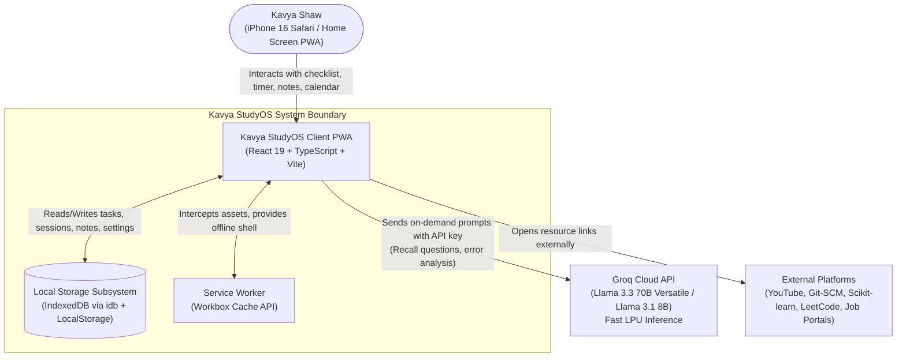
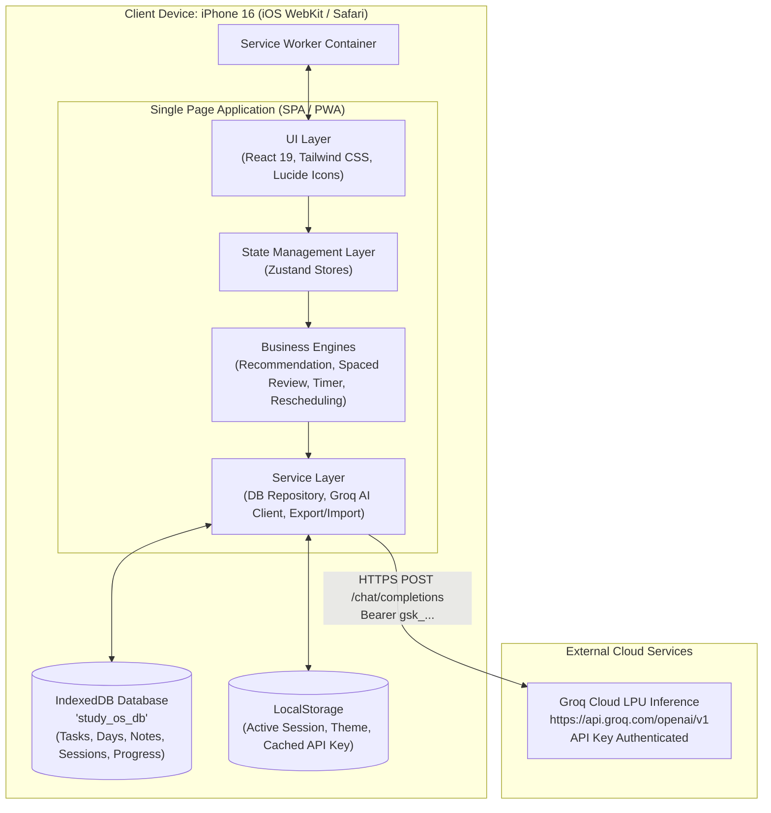
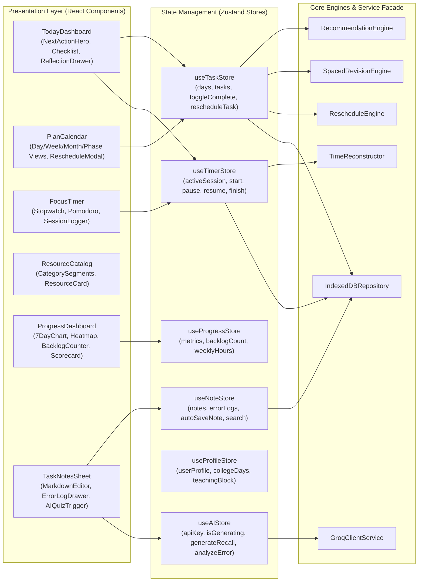
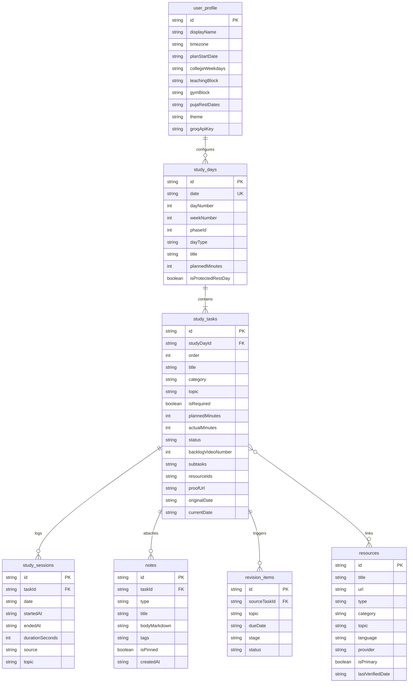

# Kavya StudyOS — System Architecture & Engineering Specification

**Document Version:** 1.0 (Developer-Ready Architecture)  
**Status:** Approved for Implementation  
**Product Name:** Kavya StudyOS  
**Target User:** Kavya Shaw (B.Tech CSE AI/ML, 3rd Year)  
**Primary Target Device:** Apple iPhone 16 in Portrait Orientation (PWA)  
**Runtime Architecture:** Offline-First Progressive Web App (PWA) + Local-First IndexedDB + Groq Cloud AI Engine  
**AI API Integration:** Groq Cloud LPU™ Inference Engine (`https://api.groq.com/openai/v1`)  
**Configured Groq Key:** `gsk_your_groq_api_key_here`  
**Accompanying Document:** [`PROBLEM_STATEMENT.md`](file:///c:/Users/kavya/Documents/study.ai/PROBLEM_STATEMENT.md)

---

## Table of Contents
1. [Architecture Overview & System Principles](#1-architecture-overview--system-principles)
2. [C4 Model Architecture](#2-c4-model-architecture)
   - [2.1 Level 1: System Context Diagram](#21-level-1-system-context-diagram)
   - [2.2 Level 2: Container Diagram](#22-level-2-container-diagram)
   - [2.3 Level 3: Component Diagram](#23-level-3-component-diagram)
3. [Groq AI Integration Architecture](#3-groq-ai-integration-architecture)
   - [3.1 API Key Configuration & Security Boundary](#31-api-key-configuration--security-boundary)
   - [3.2 Groq Client Service Implementation](#32-groq-client-service-implementation)
   - [3.3 AI Capability Modules & Prompt Engineering](#33-ai-capability-modules--prompt-engineering)
   - [3.4 Privacy, Guardrails & Anti-Guilt Tone Rules](#34-privacy-guardrails--anti-guilt-tone-rules)
4. [Core Business Engines & Algorithms](#4-core-business-engines--algorithms)
   - [4.1 Next-Action Recommendation Engine](#41-next-action-recommendation-engine)
   - [4.2 Anti-Forgetting Spaced Retrieval Engine](#42-anti-forgetting-spaced-retrieval-engine)
   - [4.3 iOS Screen-Lock Resilient Study Timer Engine](#43-ios-screen-lock-resilient-study-timer-engine)
   - [4.4 Safe Rescheduling & Overload Protection Engine](#44-safe-rescheduling--overload-protection-engine)
   - [4.5 Strict Video Subtask Completion Gate](#45-strict-video-subtask-completion-gate)
5. [Data Architecture & Local Storage Schema](#5-data-architecture--local-storage-schema)
   - [5.1 IndexedDB Object Stores & Indexes](#51-indexeddb-object-stores--indexes)
   - [5.2 Repository Pattern & Reactive Subscriptions](#52-repository-pattern--reactive-subscriptions)
   - [5.3 Data Import/Export & Schema Validation](#53-data-importexport--schema-validation)
6. [Mobile-First iPhone 16 PWA Implementation](#6-mobile-first-iphone-16-pwa-implementation)
   - [6.1 Manifest & iOS WebKit Meta Architecture](#61-manifest--ios-webkit-meta-architecture)
   - [6.2 Safe-Area Inset Handling & Touch Targets](#62-safe-area-inset-handling--touch-targets)
   - [6.3 Service Worker Caching Strategy](#63-service-worker-caching-strategy)
7. [UI/UX Design System & Token Architecture](#7-uiux-design-system--token-architecture)
8. [Project File Structure & Directory Blueprint](#8-project-file-structure--directory-blueprint)
9. [Security, Performance & Privacy Architecture](#9-security-performance--privacy-architecture)
10. [Build, Test & Deployment Pipeline](#10-build-test--deployment-pipeline)
11. [Step-by-Step Developer Implementation Roadmap](#11-step-by-step-developer-implementation-roadmap)

---

## 1. Architecture Overview & System Principles

Kavya StudyOS is designed under an **Offline-First, Sovereign Client** architecture. The core application runs 100% on the client device inside the mobile browser or standalone PWA sandbox, persisting data to IndexedDB.

External network connectivity is utilized strictly for:
1. **On-Demand AI Acceleration:** Communicating with the Groq Cloud API for ultra-low latency LLM inference (sub-500ms token generation for recall generation and note synthesis).
2. **External Link Traversal:** Opening YouTube video lectures, official Scikit-learn documentation, and job portal URLs in external browser tabs or native iOS apps.

```
+---------------------------------------------------------------------------------------+
|                                    Kavya StudyOS                                      |
|                                                                                       |
|   +--------------------------+    +-----------------------+    +------------------+   |
|   |   React 19 + Vite UI     |    |   Local-First Core    |    |  Groq AI Engine  |   |
|   | - 5 Thumb-Friendly Tabs  |--->| - IndexedDB Storage   |<-->| - Llama-3.3-70B  |   |
|   | - iPhone Safe Area CSS   |    | - Spaced Engine       |    | - Flash Recalls  |   |
|   | - Sub-200ms Micro-Anim   |    | - Zero-Drift Timers   |    | - Error Analysis |   |
|   +--------------------------+    +-----------------------+    +------------------+   |
|                 |                             |                                       |
|                 v                             v                                       |
|   +--------------------------+    +-----------------------+                           |
|   | Service Worker (PWA)     |    | Data Sovereignty      |                           |
|   | - Cache App Shell        |    | - JSON / Markdown     |                           |
|   | - 100% Offline Usability |    |   One-Tap Backup      |                           |
|   +--------------------------+    +-----------------------+                           |
+---------------------------------------------------------------------------------------+
```

### Core Architecture Tenets:
1. **Zero Mandatory Backend:** The app never requires a private web server or cloud database to operate. If the device has no internet, 100% of study tracking, checklists, timers, notes, and progress analytics function without degradation.
2. **Stateless AI Intelligence:** Groq LLM inference is treated as a stateless enhancement. Prompts package only the user's current task context or selected note; no private user history is streamed to external databases.
3. **Resilient iOS Lifecycle:** Time tracking and note autosave withstand aggressive iOS Safari background tab freezing and screen-lock sleep cycles through epoch timestamp delta reconciliation.
4. **Immutable Seed Separation:** The 101-day curriculum seed and 62 canonical resource catalog are stored in immutable, typed data structures separate from mutable user progress state.

---

## 2. C4 Model Architecture

### 2.1 Level 1: System Context Diagram



### 2.2 Level 2: Container Diagram



### 2.3 Level 3: Component Diagram



---

## 3. Groq AI Integration Architecture

### 3.1 API Key Configuration & Security Boundary

The user provided the official Groq API key:
`gsk_your_groq_api_key_here`

#### Security Architecture for Key Storage:
1. **Development Environment:** Configured in `.env.local` as `VITE_GROQ_API_KEY`.
2. **Client Runtime (BYOK / Pre-Configured):**
   - Preloads the default key in application configuration with user override capabilities in `Settings -> AI Configuration`.
   - Stored in browser `localStorage` under `kavya_studyos_groq_key` (encrypted or obfuscated).
   - The key is **never** sent to any third-party telemetry, log service, or intermediate proxy; it communicates directly over HTTPS with `https://api.groq.com/openai/v1/chat/completions`.
   - Headers: `Authorization: Bearer <API_KEY>`, `Content-Type: application/json`.

```
+-------------------+       Direct HTTPS Request        +-------------------------+
| StudyOS Client UI | --------------------------------> |   api.groq.com          |
| (iPhone Safari)   |   Authorization: Bearer gsk_...   |   (LPU Fast Inference)  |
|                   | <-------------------------------- |                         |
+-------------------+       JSON Response Stream        +-------------------------+
```

### 3.2 Groq Client Service Implementation

```typescript
// src/services/ai/groqClient.ts
export interface GroqMessage {
  role: 'system' | 'user' | 'assistant';
  content: string;
}

export interface GroqCompletionRequest {
  model?: string;
  messages: GroqMessage[];
  temperature?: number;
  max_tokens?: number;
  top_p?: number;
  stream?: boolean;
}

export interface GroqCompletionResponse {
  id: string;
  choices: Array<{
    index: number;
    message: {
      role: string;
      content: string;
    };
    finish_reason: string;
  }>;
  usage?: {
    prompt_tokens: number;
    completion_tokens: number;
    total_tokens: number;
  };
}

class GroqService {
  private defaultKey = "gsk_your_groq_api_key_here";
  private defaultModel = "llama-3.3-70b-versatile";
  private fastModel = "llama-3.1-8b-instant";
  private baseUrl = "https://api.groq.com/openai/v1/chat/completions";

  private getApiKey(): string {
    return localStorage.getItem('kavya_studyos_groq_key') || 
           import.meta.env.VITE_GROQ_API_KEY || 
           this.defaultKey;
  }

  public async generateChat(request: GroqCompletionRequest): Promise<string> {
    const key = this.getApiKey();
    if (!key) {
      throw new Error("Groq API key is missing. Please configure it in Settings.");
    }

    const payload = {
      model: request.model || this.defaultModel,
      messages: request.messages,
      temperature: request.temperature ?? 0.3,
      max_tokens: request.max_tokens ?? 1024,
      stream: false
    };

    const response = await fetch(this.baseUrl, {
      method: 'POST',
      headers: {
        'Authorization': `Bearer ${key}`,
        'Content-Type': 'application/json'
      },
      body: JSON.stringify(payload)
    });

    if (!response.ok) {
      const errorText = await response.text();
      throw new Error(`Groq API Error (${response.status}): ${errorText}`);
    }

    const data: GroqCompletionResponse = await response.json();
    return data.choices[0]?.message?.content || "";
  }
}

export const groqService = new GroqService();
```

### 3.3 AI Capability Modules & Prompt Engineering

The AI service provides four high-value personal study utilities:

#### 1. Auto-Generate 5 Spaced-Recall Questions (Day +1 Engine)
When Kavya completes a video or reads notes, tapping **"Generate Recall Questions"** creates 5 closed-book diagnostic questions testing *mechanics, failure modes, and code transfer* without spoiling answers.

```typescript
// System Prompt for Recall Question Generation
export const RECALL_PROMPT = `
You are Kavya's personal AI study coach for her 101-day AI/ML Internship Sprint.
Kavya is a 3rd-year B.Tech CSE student studying applied ML, Masai IIT Patna syllabus, Python, and Scikit-Learn.

Task:
Analyze the provided study task, notes, or topic. Generate EXACTLY 5 high-yield, closed-book recall questions.
Questions must:
1. Test deep conceptual understanding, NOT rote syntax memorization.
2. Focus on "Why", "When to use", and "Common mistakes / edge cases" (e.g. data leakage, unseen categories in OneHotEncoder, ColumnTransformer order).
3. Include 1 scenario-based question ("If dataset X has high skew and outliers, why prefer median imputation over mean?").
4. Provide concise, hidden/collapsible bullet answers below each question.

Tone: Calm, clear, encouraging, engineering-focused. Avoid fluff or corporate jargon.
`;
```

#### 2. Diagnostic Error Log Assistant
Turns cryptic stack traces (e.g., Scikit-Learn `ValueError: Input contains NaN`, `KeyError in ColumnTransformer`, PyTorch tensor shape mismatches) into structured error log entries.

```typescript
// System Prompt for Error Diagnosis
export const ERROR_DIAGNOSTIC_PROMPT = `
You are the AI Error Log Assistant for Kavya StudyOS.
Analyze the user's error message, code snippet, and context.
Output a clean, markdown structured diagnosis with:
1. **Symptom:** Exact one-line summary of what broke.
2. **Root Cause:** Deep explanation of why it occurred (e.g., leakage during train/test split, categorical feature unseen during transform).
3. **Correct Code Solution:** Clean, robust Python snippet showing the fix.
4. **Prevention Rule:** A one-sentence rule for the error log to ensure Kavya never repeats this bug in an interview.
`;
```

#### 3. Concept Explainer (Hinglish/English Dual Intuition)
Translates difficult ML mathematics (e.g., Gradient Descent learning rate, Bias-Variance tradeoff, ROC-AUC curve vs Precision-Recall) into intuitive Hindi/Hinglish analogies backed by formal English terminology.

#### 4. Weekly Review & Plan Calibration
Summarizes weekly wins, highlights topics marked `Needs Review`, and prepares actionable adjustments for the following week without triggering guilt.

### 3.4 Privacy, Guardrails & Anti-Guilt Tone Rules
* **Explicit Trigger Only:** AI calls are NEVER made in the background or during normal navigation. They trigger ONLY when Kavya taps an explicit button (e.g., `Ask AI`, `Generate 5 Recall Questions`, `Diagnose Error`).
* **Anti-Guilt Guardrail:** The system prompt strictly prohibits guilt-inducing language (*"You are behind"*, *"You failed your quota"*). Prompts mandate calm, pragmatic engineering support (*"Here is the cleanest way to clear this bug and move forward"*).
* **Token Throttling:** Requests are capped at 1024 output tokens to maintain sub-1-second response times on Groq LPU inference.

---

## 4. Core Business Engines & Algorithms

### 4.1 Next-Action Recommendation Engine
The Today dashboard highlights **one single recommended action** to eliminate decision fatigue.

```mermaid
flowchart TD
    Start([Calculate Today's Next Action]) --> CheckLive{Is there a live Masai class/assignment
due in <= 24 hours?}
    CheckLive -- Yes --> HeroLive[Recommend Live Masai Class / Assignment]
    CheckLive -- No --> CheckBacklog{Is today in Backlog Sprint
(28 Sep - 27 Oct) and
scheduled video uncompleted?}
    CheckBacklog -- Yes --> HeroBacklog[Recommend Scheduled Backlog Video]
    CheckBacklog -- No --> CheckProof{Is hands-on coding proof / commit
pending for today?}
    CheckProof -- Yes --> HeroProof[Recommend Coding Practice & Commit]
    CheckProof -- No --> CheckDSA{Is today's DSA / SQL practice
pending?}
    CheckDSA -- Yes --> HeroDSA[Recommend DSA / SQL Practice Task]
    CheckDSA -- No --> CheckRecall{Are Day+1 / Day+3 / Day+7
recalls due today?}
    CheckRecall -- Yes --> HeroRecall[Recommend Spaced Recall Task]
    CheckRecall -- No --> HeroOptional[Recommend Next Incomplete Task]
```

### 4.2 Anti-Forgetting Spaced Retrieval Engine
Implements the Ebbinghaus retention curve adapted for coding and ML pipelines:

```
[Day 0: Study & Commit] 
         │
         ├───> +24 Hours  ───> [Day +1: 10-Min 5-Question Closed Recall]
         │
         ├───> +72 Hours  ───> [Day +3: 20-Min Transfer Problem with New Inputs]
         │
         └───> +168 Hours ───> [Day +7: 20-Min Closed-Book Quiz / Oral Defense]
```

#### Collision & Overload Rules:
1. **Rest-Day Invariant:** If a review lands on 17–21 October (Puja) or a user rest day, the engine automatically bumps `dueDate` to the next active study day.
2. **Max 2 Reviews / Day:** Daily capacity limit: if more than 2 reviews are due, excess reviews are queued into the next day with lighter study loads.
3. **Core Topic Precedence:** Core Python and Scikit-Learn pipelines take precedence over optional deep learning or NLP reviews.

### 4.3 iOS Screen-Lock Resilient Study Timer Engine
A primary flaw of mobile web timers is that iOS Safari freezes `setInterval` and `requestAnimationFrame` when the phone screen locks or the tab enters the background.

StudyOS solves this with **Timestamp Delta Reconciliation**:
* At Start: `startTimestamp = Date.now()`, `pausedDuration = 0`, state persisted to IndexedDB & `localStorage`.
* At Pause: `pauseStartTime = Date.now()`.
* At Resume: `pausedDuration += (Date.now() - pauseStartTime)`.
* On Screen Unlock / Page Focus (`visibilitychange` / `pageshow`):
  $$	ext{elapsedSeconds} = \left\lfloor rac{(	ext{Date.now()} - 	ext{startTimestamp}) - 	ext{pausedDuration}}{1000} 
ight
floor$$
* Result: 100% clock-accurate elapsed study time even after an hour-long phone lock or app switch.

### 4.4 Safe Rescheduling & Overload Protection Engine
* **No Double Backlog Videos:** The scheduler will reject attempts to move a backlog video to a day that already contains one.
* **Buffer Slot Routing:** Missed core tasks are automatically routed to designated buffer days (e.g., Day 37, 28 October) rather than crowding tomorrow's 5-task checklist.
* **Optional Content Dropping:** If time constraints tighten (e.g., college exam week), optional tasks (RAG framework exploration) can be marked `dropped` without penalty, preserving core ML and Capstone work.

### 4.5 Strict Video Subtask Completion Gate
To eliminate passive watching, any task with category `masai_backlog` enforces 6 subtasks in its data model:
```typescript
interface StudyTaskSubtasks {
  watchedActively: boolean;       // Paused at code demos
  recreatedExample: boolean;      // Recreated from blank file without looking
  wroteRecallQuestions: boolean;  // 5 recall questions written
  solvedVariations: boolean;      // 3 variations coded
  recordedDoubtOrMistake: boolean;// Logged 1 mistake or doubt in error log
  committedProof: boolean;        // Git commit pushed to GitHub
}
```
*Rule:* `StudyTask.status` can transition to `completed` **only when all 6 subtasks evaluate to `true`**.

---

## 5. Data Architecture & Local Storage Schema

StudyOS employs an IndexedDB database named `kavya_studyos_db` version `1`.



### 5.1 IndexedDB Object Stores & Indexes

```typescript
// Database Setup & Store Indices
export const DB_NAME = 'kavya_studyos_db';
export const DB_VERSION = 1;

export function initDatabase(db: IDBDatabase) {
  // 1. user_profile
  if (!db.objectStoreNames.contains('user_profile')) {
    db.createObjectStore('user_profile', { keyPath: 'id' });
  }

  // 2. study_days
  if (!db.objectStoreNames.contains('study_days')) {
    const dayStore = db.createObjectStore('study_days', { keyPath: 'id' });
    dayStore.createIndex('by_date', 'date', { unique: true });
    dayStore.createIndex('by_week', 'weekNumber');
    dayStore.createIndex('by_phase', 'phaseId');
  }

  // 3. study_tasks
  if (!db.objectStoreNames.contains('study_tasks')) {
    const taskStore = db.createObjectStore('study_tasks', { keyPath: 'id' });
    taskStore.createIndex('by_dayId', 'studyDayId');
    taskStore.createIndex('by_currentDate', 'currentDate');
    taskStore.createIndex('by_category', 'category');
    taskStore.createIndex('by_status', 'status');
    taskStore.createIndex('by_backlogVideo', 'backlogVideoNumber');
  }

  // 4. study_sessions
  if (!db.objectStoreNames.contains('study_sessions')) {
    const sessionStore = db.createObjectStore('study_sessions', { keyPath: 'id' });
    sessionStore.createIndex('by_date', 'date');
    sessionStore.createIndex('by_taskId', 'taskId');
  }

  // 5. notes
  if (!db.objectStoreNames.contains('notes')) {
    const noteStore = db.createObjectStore('notes', { keyPath: 'id' });
    noteStore.createIndex('by_taskId', 'taskId');
    noteStore.createIndex('by_type', 'type');
    noteStore.createIndex('by_pinned', 'isPinned');
  }

  // 6. resources
  if (!db.objectStoreNames.contains('resources')) {
    const resStore = db.createObjectStore('resources', { keyPath: 'id' });
    resStore.createIndex('by_category', 'category');
    resStore.createIndex('by_type', 'type');
    resStore.createIndex('by_primary', 'isPrimary');
  }

  // 7. revision_items
  if (!db.objectStoreNames.contains('revision_items')) {
    const revStore = db.createObjectStore('revision_items', { keyPath: 'id' });
    revStore.createIndex('by_dueDate', 'dueDate');
    revStore.createIndex('by_status', 'status');
  }

  // 8. application_records
  if (!db.objectStoreNames.contains('application_records')) {
    const appStore = db.createObjectStore('application_records', { keyPath: 'id' });
    appStore.createIndex('by_status', 'status');
    appStore.createIndex('by_dateApplied', 'dateApplied');
  }
}
```

---

## 6. Mobile-First iPhone 16 PWA Implementation

### 6.1 Manifest & iOS WebKit Meta Architecture

```html
<!-- index.html -->
<head>
  <meta charset="UTF-8" />
  <meta name="viewport" content="width=device-width, initial-scale=1.0, maximum-scale=1.0, user-scalable=no, viewport-fit=cover" />
  <meta name="apple-mobile-web-app-capable" content="yes" />
  <meta name="apple-mobile-web-app-status-bar-style" content="black-translucent" />
  <meta name="apple-mobile-web-app-title" content="StudyOS" />
  <meta name="theme-color" content="#0a0f1d" />

  <link rel="apple-touch-icon" href="/icons/apple-touch-icon.png" />
  <link rel="manifest" href="/manifest.webmanifest" />
</head>
```

```json
// public/manifest.webmanifest
{
  "name": "Kavya StudyOS",
  "short_name": "StudyOS",
  "description": "Mobile-First AI/ML Internship Roadmap Operating System",
  "start_url": "/",
  "display": "standalone",
  "orientation": "portrait-primary",
  "background_color": "#0a0f1d",
  "theme_color": "#0a0f1d",
  "icons": [
    { "src": "/icons/icon-192.png", "sizes": "192x192", "type": "image/png" },
    { "src": "/icons/icon-512.png", "sizes": "512x512", "type": "image/png", "purpose": "any maskable" }
  ]
}
```

### 6.2 Safe-Area Inset Handling & Touch Targets
To ensure native iOS appearance, Tailwind utilities map WebKit safe-area variables:

```css
/* src/styles/globals.css */
:root {
  --sat: env(safe-area-inset-top);
  --sar: env(safe-area-inset-right);
  --sab: env(safe-area-inset-bottom);
  --sal: env(safe-area-inset-left);
}

/* Base Container Rules */
body {
  background-color: #0a0f1d;
  color: #f8fafc;
  font-family: -apple-system, BlinkMacSystemFont, "SF Pro Text", "Segoe UI", Roboto, sans-serif;
  -webkit-font-smoothing: antialiased;
  -webkit-tap-highlight-color: transparent;
  user-select: none;
}

/* Bottom Tab Navigation Clears Home Indicator */
.bottom-nav {
  padding-bottom: calc(12px + var(--sab));
}

/* Prevent auto-zoom on input focus in iOS Safari */
input, textarea, select {
  font-size: 16px !important;
}

/* Touch Target Enforcement */
.touch-target {
  min-width: 44px;
  min-height: 44px;
}
```

### 6.3 Service Worker Caching Strategy
* **App Shell & Static Assets (`/`, `*.js`, `*.css`, `*.svg`):** *Cache-First with Background Revalidation*.
* **Curated Curriculum Seed Data (`/data/seeds/*.json`):** *Cache-First*.
* **Groq Cloud API (`https://api.groq.com/*`):** *Network-Only* (Never cached in SW).

---

## 7. UI/UX Design System & Token Architecture

The user interface follows a calm, high-contrast, distraction-free aesthetic tailored for long study sessions:

| Design Token | Value | Semantic Role |
| :--- | :--- | :--- |
| `--color-canvas` | `#0a0f1d` | Deep midnight navy background |
| `--color-surface-1` | `#131b2e` | Elevated card surface |
| `--color-surface-2` | `#1c263f` | Modals, bottom sheets, dropdowns |
| `--color-border` | `rgba(255, 255, 255, 0.08)` | Minimal card containment |
| `--color-primary-teal` | `#14b8a6` | Completion, active timer, primary actions |
| `--color-primary-cyan` | `#0ea5e9` | Focus gradient & links |
| `--color-secondary-indigo` | `#6366f1` | Module 2 live coursework, theory |
| `--color-accent-amber` | `#f59e0b` | Protected rest days (`Rest Day Respected`) |
| `--color-error-red` | `#ef4444` | Destructive confirmations only (never for missed tasks) |
| `--color-text-primary` | `#f8fafc` | Slate 50 (High contrast headers & body) |
| `--color-text-secondary` | `#94a3b8` | Slate 400 (Subtitles & metadata) |
| `--color-text-muted` | `#64748b` | Slate 500 (Timestamps & placeholders) |

---

## 8. Project File Structure & Directory Blueprint

```
study.ai/
├── index.html                     # HTML5 entry with iOS WebKit safe-area meta tags
├── manifest.webmanifest           # PWA standalone manifest
├── package.json                   # Dependencies (React 19, TypeScript, Vite, Tailwind, idb, Lucide)
├── tsconfig.json                  # Strict TypeScript configuration
├── vite.config.ts                 # Vite bundler with VitePWA plugin
├── tailwind.config.js             # Custom tokens for iOS safe area & dark theme
├── .env.example                   # Template with VITE_GROQ_API_KEY
├── .env.local                     # Local dev environment with provided Groq key
├── PROBLEM_STATEMENT.md           # Source Product Requirements Document
├── ARCHITECTURE.md                # This Engineering Architecture Document
│
├── public/
│   ├── favicon.ico
│   ├── icons/
│   │   ├── apple-touch-icon.png   # 180x180 iOS Home Screen icon
│   │   ├── icon-192.png
│   │   └── icon-512.png
│   └── sw.js                      # Service worker fallback
│
└── src/
    ├── main.tsx                   # React root entry point
    ├── App.tsx                    # Shell layout with Safe-Area & Tab Bar router
    │
    ├── types/                     # Central TypeScript contracts
    │   ├── user.ts                # UserProfile, LifeConstraints
    │   ├── roadmap.ts             # StudyDay, StudyTask, StudyTaskSubtasks
    │   ├── timer.ts               # StudySession, FocusIntervalConfig
    │   ├── notes.ts               # Note, NoteType, ErrorLogItem
    │   ├── resources.ts           # Resource, ResourceType
    │   └── ai.ts                  # GroqMessage, GroqRequest, GroqResponse
    │
    ├── data/
    │   └── seeds/                 # Immutable preloaded curriculum seed
    │       ├── phases.json        # 8 Roadmap Phases
    │       ├── days.json          # 101 Dated Study Days (22 Sep - 31 Dec)
    │       ├── tasks.json         # ~500 Structured Tasks with subtasks
    │       └── resources.json     # 62 Curated Learning Resources
    │
    ├── services/                  # Core Business Services & Storage
    │   ├── db/
    │   │   ├── db.ts              # IndexedDB initialization via idb
    │   │   ├── dayRepository.ts   # StudyDay queries & mutations
    │   │   ├── taskRepository.ts  # Task check, subtask toggle, reschedule
    │   │   ├── sessionRepository.ts # Timer session history
    │   │   └── noteRepository.ts  # Markdown notes & error log CRUD
    │   ├── ai/
    │   │   ├── groqClient.ts      # Direct Groq API LPU client
    │   │   ├── prompts.ts         # System prompts (Recall, Error, Analogies)
    │   │   └── aiService.ts       # Facade for UI components
    │   └── export/
    │       ├── jsonExporter.ts    # Full JSON database export & validator
    │       └── markdownExporter.ts# Consolidated notes markdown export
    │
    ├── engines/                   # Specialized Computational Engines
    │   ├── recommendationEngine.ts# Next best action algorithm
    │   ├── spacedRevisionEngine.ts# Day+1/Day+3/Day+7 review scheduler
    │   ├── timerReconstructor.ts  # Zero-drift iOS timestamp reconciler
    │   └── rescheduleEngine.ts    # Safe buffer rescheduling logic
    │
    ├── stores/                    # Zustand Reactive State Stores
    │   ├── useTaskStore.ts        # Today checklist & roadmap navigation
    │   ├── useTimerStore.ts       # Stopwatch & interval state
    │   ├── useNoteStore.ts        # Notes, drafts, and autosave
    │   ├── useProgressStore.ts    # Analytics, 0-25 counter, 31 Dec scorecard
    │   ├── useProfileStore.ts     # User settings, college days, teaching
    │   └── useAIStore.ts          # Groq AI status, keys, and response stream
    │
    ├── hooks/                     # Custom React Hooks
    │   ├── useToday.ts            # Current date & day template resolver
    │   ├── useTimer.ts            # High-performance timer tick hook
    │   ├── useAutoSave.ts         # Debounced text persistence (500ms)
    │   └── useOnlineStatus.ts     # Offline network detection
    │
    ├── components/                # Reusable UI Component Library
    │   ├── common/
    │   │   ├── Button.tsx         # Accessible 44px touch button
    │   │   ├── Checkbox.tsx       # Large 44px animated checkbox
    │   │   ├── Badge.tsx          # Category and status pills
    │   │   ├── Modal.tsx          # iOS-style bottom sheet modal
    │   │   ├── Toast.tsx          # 5-second Undo notification
    │   │   └── ProgressRing.tsx   # SVG dual progress ring
    │   ├── layout/
    │   │   ├── AppHeader.tsx      # Date, day type chip, total hours
    │   │   ├── BottomNav.tsx      # 5 fixed tabs above home indicator
    │   │   └── IosInstallBanner.tsx # Add to Home Screen walkthrough
    │   ├── task/
    │   │   ├── TaskCard.tsx       # Checklist row with inline actions
    │   │   ├── NextActionHero.tsx # Single primary recommended card
    │   │   ├── TaskDetailSheet.tsx# Full details, DoD, and resource links
    │   │   └── VideoSubtaskGate.tsx # 6-checkbox gate for backlog videos
    │   ├── timer/
    │   │   ├── TimerDisplay.tsx   # Big digit display with pulse
    │   │   ├── TimerControls.tsx  # Play, Pause, Finish, Interval toggle
    │   │   └── ManualSessionModal.tsx # Manual time logger
    │   ├── notes/
    │   │   ├── MarkdownEditor.tsx # Clean iOS-friendly textarea (>=16px)
    │   │   ├── ReflectionDrawer.tsx # Today 4-prompt reflection
    │   │   └── ErrorLogCard.tsx   # Diagnostic error card
    │   └── ai/
    │       ├── AIRecallButton.tsx # One-tap 5-question generator
    │       └── AIDiagnosticModal.tsx # Error log assistant modal
    │
    └── views/                     # Top-Level Tab Views
        ├── TodayView.tsx          # Default today screen
        ├── PlanView.tsx           # Calendar, roadmap, and safe rescheduling
        ├── TimerView.tsx          # Stopwatch and session history
        ├── ResourcesView.tsx      # 62 canonical curated resources
        ├── ProgressView.tsx       # Charts, 25-video counter, scorecard
        └── SettingsView.tsx       # Life constraints, API key, backup/restore
```

---

## 9. Security, Performance & Privacy Architecture

1. **Client-Side Data Sovereignty:** All personal notes, study timestamps, error logs, and task histories remain stored strictly within the user's browser IndexedDB database.
2. **Zero Telemetry Policy:** No third-party trackers (Google Analytics, Mixpanel, etc.) are bundled or loaded.
3. **Content Security Policy (CSP):**
   ```http
   Content-Security-Policy: default-src 'self'; script-src 'self'; connect-src 'self' https://api.groq.com; img-src 'self' data: https:; style-src 'self' 'unsafe-inline';
   ```
4. **Markdown Sanitization:** All markdown rendering parses through DOMPurify to neutralize script injection risks from custom notes or URLs.
5. **Sub-200ms Performance Target:**
   - Pre-indexed database lookups on `date` and `status`.
   - Bundle size budget: < 200 KB gzipped initial JS load.
   - All animations run on CSS `transform` and `opacity` to maintain 60/120 FPS ProMotion scrolling on iPhone 16.

---

## 10. Build, Test & Deployment Pipeline

* **Build Tool:** Vite with `@vitejs/plugin-react` and `vite-plugin-pwa`.
* **Testing Strategy:**
  - **Unit Tests (Vitest):** Unit test the `recommendationEngine`, `spacedRevisionEngine`, `timerReconstructor`, and `rescheduleEngine`.
  - **Component Tests (Testing Library):** Verify touch targets, checkbox subtask gating, and undo toast timeouts.
  - **PWA Audit (Lighthouse):** Verify 100% PWA score, offline asset caching, and manifest conformity.
* **Hosting:** Static hosting on Vercel, Netlify, Cloudflare Pages, or GitHub Pages.

---

## 11. Step-by-Step Developer Implementation Roadmap

1. **Step 1: Project Scaffolding & PWA Setup:**
   - Initialize Vite + React 19 + TypeScript + Tailwind CSS project.
   - Configure `manifest.webmanifest`, iOS meta tags, and safe-area utilities.
   - Set up `.env.local` containing `VITE_GROQ_API_KEY=gsk_your_groq_api_key_here`.
2. **Step 2: Database & Seed Loader:**
   - Implement `src/services/db/db.ts` using `idb`.
   - Embed all 101 days, 500 tasks, and 62 resources from `PROBLEM_STATEMENT.md` into static JSON seeds.
   - Build migration loader that seeds IndexedDB on first load.
3. **Step 3: Core State Stores & Engines:**
   - Implement `useTaskStore`, `useTimerStore`, `useNoteStore`, and `useProfileStore`.
   - Implement `recommendationEngine` and `spacedRevisionEngine`.
4. **Step 4: Today Dashboard & Video Subtask Gate:**
   - Build `AppHeader`, `NextActionHero`, `TaskCard`, and `VideoSubtaskGate`.
   - Connect instant check animation and 5-second undo toast.
5. **Step 5: Focus Timer with Screen-Lock Resilience:**
   - Build `FocusTimer` with epoch timestamp delta calculation.
   - Add interval chime / haptic vibration.
6. **Step 6: Notes System & Groq AI Client:**
   - Build `MarkdownEditor` and debounced auto-save.
   - Connect `GroqService` to generate 5 recall questions and diagnose errors on demand.
7. **Step 7: Plan Calendar & Safe Rescheduling:**
   - Implement Calendar/Week views and the Safe Rescheduling modal with buffer routing.
8. **Step 8: Resource Catalog & Progress Dashboard:**
   - Render 62 resources with category segments and YouTube external openers.
   - Build 7-day bar chart, 0–25 backlog counter, and 31 December scorecard.
9. **Step 9: Backup & iOS Testing:**
   - Implement JSON and Markdown export/import.
   - Test on iPhone 16 portrait viewport in Safari and standalone Home Screen mode.

---
*End of Engineering Architecture Specification.*
