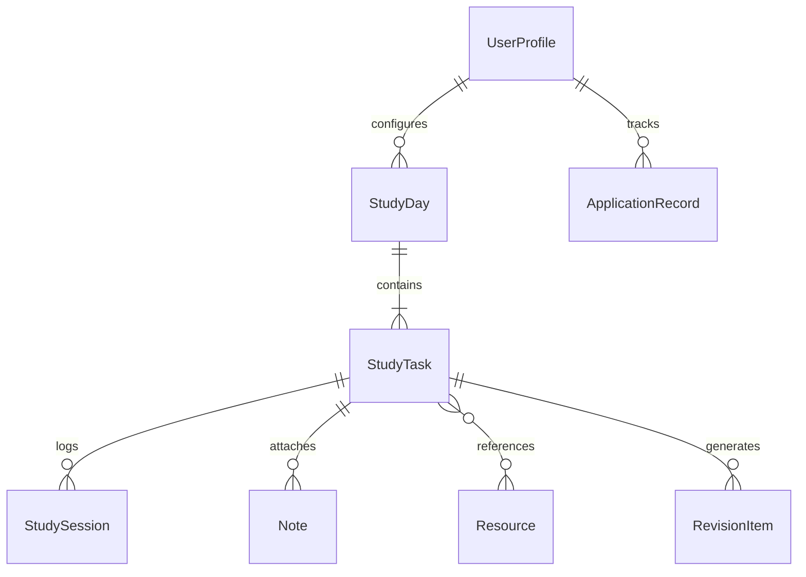

# Kavya StudyOS — Product Problem Statement & Developer-Ready Requirements (PRD)

**Document Type:** Comprehensive Product Problem Statement + Product Requirements Document (PRD)  
**Product Name:** Kavya StudyOS (Working Title, renameable before development)  
**Document Version:** 1.0 (Developer-Ready Specification)  
**Prepared For:** Kavya Shaw  
**Target Profile:** B.Tech CSE (AI/ML Specialization), 3rd Year  
**Primary Target Device:** Apple iPhone 16 in Portrait Mode (Mobile-First PWA)  
**Active Plan Window:** 22 September 2026 – 31 December 2026 (101 Scheduled Days, 14 Weeks, 62 Curated Resources)  
**Source Roadmap:** Kavya AI/ML Internship Roadmap (101-day sprint around Masai + IIT Patna, college, teaching, gym, and 25-video backlog)  
**Core Objective:** Complete Python reactivation, zero Masai backlog (25/25 videos), live Module 2 coursework mastery, 2 production-grade portfolio projects (including 1 deployed capstone), 40–55 understood DSA problems, 40+ SQL practice queries, active application pipeline (30–40 targeted roles), and full interview readiness without burnout, shame, or guilt.

---

## Table of Contents
1. [Executive Summary](#1-executive-summary)
2. [Problem Statement](#2-problem-statement)
   - [2.1 Current Problem & Operational Breakdown](#21-current-problem--operational-breakdown)
   - [2.2 Product Opportunity](#22-product-opportunity)
   - [2.3 Core Problem Statement](#23-core-problem-statement)
3. [Product Vision, Desired Outcomes & Non-Goals](#3-product-vision-desired-outcomes--non-goals)
   - [3.1 Product Vision](#31-product-vision)
   - [3.2 Desired Tangible Outcomes by 31 December 2026](#32-desired-tangible-outcomes-by-31-december-2026)
   - [3.3 Explicit Non-Goals](#33-explicit-non-goals)
4. [Target User Persona & Real-Life Constraints](#4-target-user-persona--real-life-constraints)
   - [4.1 Primary Persona](#41-primary-persona)
   - [4.2 Fixed Commitments & Real-Life Constraints](#42-fixed-commitments--real-life-constraints)
   - [4.3 Configurable Assumptions](#43-configurable-assumptions)
5. [Product Principles & Design Philosophy](#5-product-principles--design-philosophy)
6. [Information Architecture & Navigation](#6-information-architecture--navigation)
7. [Detailed Screen & Functional Requirements](#7-detailed-screen--functional-requirements)
   - [7.1 Onboarding & iPhone Installation Helper](#71-onboarding--iphone-installation-helper)
   - [7.2 Today Dashboard & Recommendation Engine](#72-today-dashboard--recommendation-engine)
   - [7.3 Task Detail & Strict Video Subtask Completion Gate](#73-task-detail--strict-video-subtask-completion-gate)
   - [7.4 Plan, Calendar & Safe Rescheduling Engine](#74-plan-calendar--safe-rescheduling-engine)
   - [7.5 Focus Timer & Study-Time Tracking Engine](#75-focus-timer--study-time-tracking-engine)
   - [7.6 Contextual Notes, Doubts & Error Log System](#76-contextual-notes-doubts--error-log-system)
   - [7.7 Curated Resource Catalog](#77-curated-resource-catalog)
   - [7.8 Progress Analytics & Consistency System](#78-progress-analytics--consistency-system)
   - [7.9 Settings, Privacy & Local Data Control](#79-settings-privacy--local-data-control)
8. [Roadmap & Curriculum Architecture to Preload](#8-roadmap--curriculum-architecture-to-preload)
   - [8.1 Master Phase Map & Exit Outcomes](#81-master-phase-map--exit-outcomes)
   - [8.2 Week-by-Week Curriculum Blueprint (Weeks 1–14 + Final Sprint)](#82-week-by-week-curriculum-blueprint-weeks-114--final-sprint)
   - [8.3 Module Alignment: Module 1 Refresh vs Live Module 2](#83-module-alignment-module-1-refresh-vs-live-module-2)
   - [8.4 Daily Task Templates (College, Non-College, Rest, Emergency Minimum)](#84-daily-task-templates-college-non-college-rest-emergency-minimum)
   - [8.5 Landmark Seed Days](#85-landmark-seed-days)
9. [Spaced-Revision (Anti-Forgetting) Engine](#9-spaced-revision-anti-forgetting-engine)
10. [Resource Catalog to Preload (62 Canonical Links)](#10-resource-catalog-to-preload-62-canonical-links)
    - [10.1 Videos — Python, DSA and Git](#101-videos--python-dsa-and-git)
    - [10.2 Notes, Docs & Practice — Python, DSA and Git](#102-notes-docs--practice--python-dsa-and-git)
    - [10.3 Videos — NumPy, Pandas, Visualization, EDA and SQL](#103-videos--numpy-pandas-visualization-eda-and-sql)
    - [10.4 Notes and Practice — Pandas and Data](#104-notes-and-practice--pandas-and-data)
    - [10.5 Videos — Mathematics and Machine Learning](#105-videos--mathematics-and-machine-learning)
    - [10.6 Notes, Docs & Practice — Machine Learning](#106-notes-docs--practice--machine-learning)
    - [10.7 Videos — Deep Learning, NLP, LLM and RAG](#107-videos--deep-learning-nlp-llm-and-rag)
    - [10.8 Notes and Courses — LLM and RAG](#108-notes-and-courses--llm-and-rag)
    - [10.9 Videos — Deployment and Engineering](#109-videos--deployment-and-engineering)
    - [10.10 Notes and Documentation — Deployment](#1010-notes-and-documentation--deployment)
    - [10.11 Jobs, Portals and Applications](#1011-jobs-portals-and-applications)
    - [10.12 Schedule and Calendar References](#1012-schedule-and-calendar-references)
11. [Premium iPhone UI/UX Specification](#11-premium-iphone-uiux-specification)
12. [Technical Architecture & Offline Strategy](#12-technical-architecture--offline-strategy)
13. [Data Model & TypeScript Schemas](#13-data-model--typescript-schemas)
14. [Business & Calculation Rules](#14-business--calculation-rules)
15. [Notification Engine](#15-notification-engine)
16. [Privacy, Security & Data Sovereignty](#16-privacy-security--data-sovereignty)
17. [Empty, Offline & Error States](#17-empty-offline--error-states)
18. [Acceptance Criteria](#18-acceptance-criteria)
19. [Testing Plan & Critical Test Journeys](#19-testing-plan--critical-test-journeys)
20. [Delivery Phases (MVP to Intelligence)](#20-delivery-phases-mvp-to-intelligence)
21. [Definition of Done](#21-definition-of-done)
22. [Developer Handoff Instructions](#22-developer-handoff-instructions)
23. [Research Basis & Implementation References](#23-research-basis--implementation-references)

---

## 1. Executive Summary

**Kavya StudyOS** is a premium, mobile-first personal study operating system designed specifically for the Apple iPhone 16 (and modern mobile browsers) that transforms an extensive 101-day AI/ML internship roadmap into a calm, focused, and frictionless daily execution partner.

The product tells Kavya exactly what to study each day, line by line. Each day contains approximately five bite-sized tasks. Every task features a large touch target checkbox, expected duration, topic/category, direct deep-link to curated study resources, a one-tap focus timer, and an integrated notes/error area. When a task is checked, the application immediately updates task completion and daily progress without page reloads.

```
+-------------------------------------------------------------------------------+
|                                Kavya StudyOS                                  |
|   "Open app -> Understand plan in 5s -> Study from exact resource ->          |
|    Record proof & commit -> Spaced revision auto-scheduled -> Calm close"     |
+-------------------------------------------------------------------------------+
        |                               |                               |
        v                               v                               v
 [Today Execution]             [Anti-Forgetting]              [Real-Life Balance]
 - Next-Action Hero Card       - Day 0: Practice & Commit     - 3 College Days (2-2.5h)
 - 5-Task Daily Checklist      - Day +1: 10m Closed Recall    - 4 Non-College (4-5h)
 - 1-Tap Stopwatch/Timer       - Day +3: Transfer Challenge   - 1.5h Teaching Protected
 - Active Video Subtasks       - Day +7: Oral / Quiz Gate     - Morning Gym Protected
 - Inline Notes & Error Log    - Weekly: Failed Task Redo     - 5-Day Puja Planned Rest
```

### Key System Capabilities:
* **True Study Time Recording:** Measures actual study duration via a live stopwatch/interval timer with state restoration across iOS screen locks, plus manual time adjustments.
* **Full 101-Day Roadmap Preload:** Houses the complete 14-week curriculum across 8 distinct phases, from Python reactivation to final interview mock audits.
* **Strict Video Completion Rule:** Prevents passive viewing by requiring code recreation from a blank file, 5 recall questions, 3 variations, error logging, and Git commits before marking backlog videos complete.
* **Separated Multi-Format Resources:** Clearly bifurcates primary Hindi/Hinglish videos from English documentation, official specs, and practice exercises.
* **Durga Puja & Rest Protection:** Treats planned rest days (17–21 October) as 100% successful rest days rather than missed study days, with zero streak resets or overdue task accumulation.
* **Offline-First & Local-First:** All data, timers, notes, and progress logs reside securely in on-device IndexedDB without requiring mandatory accounts or external servers.

---

## 2. Problem Statement

### 2.1 Current Problem & Operational Breakdown
Kavya has a detailed 30-page AI/ML internship roadmap, but a static PDF document cannot:
1. Show only today's relevant tasks on a mobile screen.
2. Track completion at the individual task and subtask level.
3. Measure actual focused study time versus clock time.
4. Save notes, code snippets, and error logs beside the exact topic being studied.
5. Clarify which Masai backlog video is scheduled next.
6. Distinguish live Module 2 work from old backlog catch-up work.
7. Remind the user about Day+1, Day+3, and Day+7 spaced retrieval revision.
8. Safely reschedule a missed task without triggering an avalanche of overdue debt.
9. Graph study consistency, topic distributions, and portfolio progress over time.
10. Provide one-tap mobile access to the exact video, documentation, or LeetCode/Kaggle practice page.
11. Eliminate the anxiety of rigid streak apps that shame students for college exams or planned festival rest.

Because the plan must co-exist with 3 weekly college days, 1.5 hours of daily teaching, morning gym routines, current Masai classes, backlog recovery, daily coding practice, and a 5-day Durga Puja festival, remembering everything manually creates severe cognitive overload. Furthermore, passive video watching feels productive even when the core programming concept has not been retained or coded.

### 2.2 Product Opportunity
Convert the static roadmap into a personal, interactive study operating system:
* The app deterministically decides what is due today from the approved roadmap.
* The user sees a short, ordered checklist of ~5 tasks.
* The user starts a focus timer or logs time manually.
* The user studies, writes notes, types code from scratch, and creates verifiable Git proof.
* The user checks each completed item.
* The app calculates time, task completion, and auto-schedules spaced revision due dates.
* The app surfaces the next best action without creating guilt or burnout.

### 2.3 Formal Core Problem Statement
> **Kavya needs a mobile-first, offline-capable study tracker that transforms a 101-day AI/ML roadmap into a clear daily checklist, records actual study time, stores notes and resources beside each topic, and shows meaningful progress so that Python revision, Masai backlog recovery, current Module 2 learning, projects, and internship preparation remain manageable alongside college and other fixed commitments.**

---

## 3. Product Vision, Desired Outcomes & Non-Goals

### 3.1 Product Vision
*"Open the app, understand today's plan in under five seconds, study from the correct resource, record proof, and close the day knowing exactly what is complete and what comes next."*

### 3.2 Desired Tangible Outcomes by 31 December 2026
The product must directly enable, verify, and catalog the following visible evidence:
1. **Python Reactivation:** Complete revision of syntax, OOP, files, collections, NumPy, and Pandas with closed-book recall.
2. **Masai Backlog Cleared:** All 25 backlog videos completed with working code, notes, and spaced recall by 27 October 2026 (reaching 25/25).
3. **Live Module 2 Current:** Every new class and assignment processed within 24 hours without forming a second backlog.
4. **Applied ML Mastery:** Hands-on experience with leakage-safe pipelines, `ColumnTransformer`, `OneHotEncoder`, scaling, imputation, baseline modeling, hyperparameter tuning, and cross-validation.
5. **Version Control Fluency:** Git initialized on 27 September, first repo published on 28 September, followed by feature branching, clear commit messages, PRs, and tags.
6. **Two Core Portfolio Projects:**
   - *Project 1 (EDA + SQL):* Clear business question, data audit, cleaning decisions, SQL queries, and 5 key findings.
   - *Project 2 (Customer Churn Capstone):* End-to-end tabular ML pipeline, model evaluation, threshold tuning, unit tests with pytest, and live deployment on Streamlit.
7. **Advanced Extensions (If Core on Track):** PyTorch training loop fundamentals, NLP text baseline, semantic search demo, and an evaluated, grounded RAG pipeline with citations and abstention.
8. **DSA & SQL Fluency:** 40–55 understood easy/medium DSA problems and 40+ SQL interview queries.
9. **Internship Pipeline:** Clean one-page resume, audited GitHub/LinkedIn, 30–40 targeted applications tracked, and 3 recorded mock interviews.

### 3.3 Explicit Non-Goals
The first version must NOT become:
* A social network, peer feed, or public leaderboard.
* A competitive streak app that resets on rest days or illness.
* A multi-tenant learning management system (LMS) for multiple students.
* A replacement for Masai, YouTube, GitHub, LeetCode, or Kaggle.
* A fitness, workout, calorie, or body-weight tracker (gym is tracked only as a calendar commitment).
* An ungrounded generative AI bot that invents new curriculum every day.
* A pirated content hosting platform (only links to original external resources).

---

## 4. Target User Persona & Real-Life Constraints

### 4.1 Primary Persona
* **Name:** Kavya Shaw
* **Education:** B.Tech Computer Science & Engineering (AI/ML Specialization), 3rd Year
* **Goal:** Become ready for AI/ML, Data Science, or Applied ML internships and build a focused application pipeline for Summer 2027.
* **Primary Device:** Apple iPhone 16 in portrait orientation.
* **Preferred Learning Modality:** Primary instruction in Hindi/Hinglish video tutorials for rapid conceptual intuition; English/official documentation as secondary reference for API precision.
* **Existing Knowledge:** Python course completed once but not revised sufficiently; syntax requires active reactivation.
* **Current Course:** Masai collaboration with IIT Patna; current syllabus has reached Module 2.
* **Backlog:** 25 recorded lessons to clear between 28 September and 27 October 2026.

### 4.2 Fixed Commitments & Real-Life Constraints

| Commitment | Duration / Schedule | Impact on Study Tracker |
| :--- | :--- | :--- |
| **College & Commute** | 3 days/week (Configurable, default Mon/Wed/Fri) | Target study capped at 2.0–2.5 hours. Prioritize live Masai work and quick recall. |
| **Teaching Responsibility** | 1.5 hours daily (Configurable: default 16:30–18:00) | Protected calendar block. Never schedule study blocks or trigger notifications during this time. |
| **Morning Gym Routine** | 60–75 minutes daily (1 recovery morning/week) | Protected health routine. Excluded from study totals. Hard boundary: study does not replace gym. |
| **Durga Puja Festival** | 17–21 October 2026 (5 full days) | **Protected Rest Days.** Zero study required, zero review generation, zero streak loss, zero backlog guilt. |
| **Sleep & Recovery** | 7–8 hours nightly | Non-negotiable. Late-night study is actively discouraged; incomplete tasks are safely rescheduled. |

### 4.3 Configurable Assumptions
* **College Days:** The default template uses Monday, Wednesday, and Friday as college days. The onboarding flow allows selecting the actual three days and updating them anytime in Settings.
* **Teaching Block:** Configurable by start/end time.
* **Gym Block:** A protected morning calendar window, strictly excluded from study-hour totals.

---

## 5. Product Principles & Design Philosophy

1. **Today First:** The first screen immediately answers: *"What should I do now?"* in under 5 seconds.
2. **Proof Over Passive Watching:** A video is not complete until its linked code is recreated from scratch and committed.
3. **Current Class Before Backlog:** New Module 2 work must be processed within 24 hours so it never forms a secondary backlog.
4. **One Old Video Per Sprint Day:** Strictly 1 backlog video per active sprint day. No double-video punishment days.
5. **Time and Completion Are Separate:** 2 hours watched is not 5 tasks completed. Both metrics are independently tracked.
6. **Rest Is Planned:** Puja and rest days show zero required study (100% respected) and never break consistency.
7. **Offline First:** Today's plan, notes, and timers remain 100% operational without an active internet connection.
8. **Private by Default:** All notes and logs reside locally in IndexedDB; no telemetry or analytics trackers.
9. **Accessible by Default:** Minimum 44×44px touch targets, readable 16px+ typography, strong WCAG 2.2 AA contrast, and reduced-motion support.
10. **Flexible Without Becoming Vague:** Tasks can be rescheduled into designated buffer days, but every adjustment remains visible in history.

---

## 6. Information Architecture & Navigation

StudyOS implements a 5-tab bottom navigation bar optimized for single-handed iPhone 16 thumb reach, respecting the iOS home indicator safe area:

```
+-------------------------------------------------------------------------------+
|                                APP CONTAINER                                  |
|   [Header: Date, Day Type Chip, Progress Ring, Total Focus Minutes Today]     |
|                                                                               |
|   +-----------------------------------------------------------------------+   |
|   |                      ACTIVE VIEW / TAB CONTENT                        |   |
|   |                                                                       |   |
|   +-----------------------------------------------------------------------+   |
|                                                                               |
|   +-----------------------------------------------------------------------+   |
|   |   [ Today ]    [ Plan ]    [ Timer ]    [ Resources ]    [ Progress ]     |   |
|   +-----------------------------------------------------------------------+   |
|   |                           === Home Bar ===                            |   |
+-------------------------------------------------------------------------------+
```

| Tab | Purpose | Primary Action |
| :--- | :--- | :--- |
| **Today** | Today's tasks, time, progress, and quick reflection notes | Start next task / toggle checkbox |
| **Plan** | Calendar, weeks, 8 phases, backlog manager, future dates | Open or reschedule a day |
| **Timer** | Live focus session (stopwatch/interval) and session history | Start / pause / finish session |
| **Resources** | Curated videos, official documentation, practice links, jobs | Open external resource / save |
| **Progress** | Time trends, completion rates, backlog counter, 31 Dec scorecard | Review week and readiness |

### Contextual Notes Placement (No 6th Persistent Tab):
To keep thumb navigation focused on core loops, Notes are deliberately embedded contextually:
* Inside every task detail sheet.
* In the Today screen's quick reflection drawer.
* Attached to individual resource cards.
* Globally searchable via Search in the top navigation header.

---

## 7. Detailed Screen & Functional Requirements

### 7.1 Onboarding & iPhone Installation Helper
* **Setup Wizard (Under 3 Minutes):**
  - Welcome and brief orientation.
  - Confirm name (`Kavya Shaw`) and timezone (`Asia/Kolkata`).
  - Confirm plan start date (`2026-09-22`).
  - Select 3 weekly college days (default: Mon, Wed, Fri).
  - Configure daily 1.5-hour teaching block (default: 16:30–18:00).
  - Configure morning gym block (default: 06:30–07:45).
  - Confirm 5 Durga Puja dates (17–21 October 2026).
  - Select reminder preferences and local-first storage mode.
  - Preload the full 101-day structured curriculum and 62 canonical resources.
* **iPhone Home Screen Installation Card:**
  - Shows a dismissible helper card on mobile Safari:
    1. Open site in Safari.
    2. Tap **Share** (`⎙`).
    3. Tap **Add to Home Screen** (`⊞`).
    4. Confirm and open from Home Screen in app mode.

### 7.2 Today Dashboard & Recommendation Engine
* **Header:**
  - Greeting and formatted date (`Tuesday, 22 Sep 2026`).
  - Day type chip (`College Day`, `Non-College Day`, `Rest Day`, or `Custom`).
  - Phase and Week badge (e.g., `Phase 1: Python Reactivation • Week 1`).
  - Completed vs required task counter (`3/5 tasks`).
  - Total focused study time logged today (`2h 15m`).
* **Next Action Hero Card:**
  - Deterministic recommendation algorithm ranking:
    1. Current Masai live class or assignment due within 24 hours.
    2. Scheduled backlog video during the recovery sprint.
    3. Daily coding proof / hands-on replication.
    4. Scheduled DSA / SQL problem.
    5. Due Day+1 / Day+3 / Day+7 spaced recall task.
    6. Optional roadmap task.
  - Features: Task title, category chip, duration, primary resource badge, `Start Timer` button, and `Mark Complete` button.
* **Daily Checklist:**
  - Ordered list of ~5 study items.
  - Row controls: Large 44–48px checkbox, title, success condition, planned vs actual minutes, category icon/chip, required badge, resource count, notes button, timer trigger, and overflow menu (edit, reschedule, skip with reason).
  - Sub-200ms completion micro-animation with immediate 5-second Undo toast.
* **Daily Dual-Progress Indicators:**
  - **Task Progress:** `Completed Required Tasks / Total Required Tasks`.
  - **Time Progress:** `Actual Focused Minutes / Planned Focused Minutes`.
  - A day is NEVER marked 100% complete based only on elapsed time.
* **Quick Reflection Notepad:**
  - Expandable drawer with guided prompts: *What did I understand?*, *Where did I get stuck?*, *What should I revise?*, *What is the first task tomorrow?*
  - Debounced autosave (500ms) with visible `Saving...` -> `Saved` indicator.

### 7.3 Task Detail & Strict Video Subtask Completion Gate
* Dedicated sheet containing:
  - Full task instruction and internship rationale.
  - Explicit Definition of Done.
  - Planned vs actual tracked duration.
  - Categorized resource links (**Videos**, **Notes & Docs**, **Practice**).
  - Markdown task notes and doubt/error log.
  - GitHub commit or repository proof URL.
  - Linked revision schedule and timed session history.
* **Backlog Video Strict Completion Gate:**
  - Any task categorized as `masai_backlog` requires 6 subtasks to be checked:
    1. [ ] Watched actively (paused at code demos).
    2. [ ] Recreated key example from a blank file.
    3. [ ] Wrote 5 recall questions.
    4. [ ] Solved 3 original practice variations.
    5. [ ] Recorded at least 1 doubt or mistake in error log.
    6. [ ] Committed working code to Git.
  - Parent task cannot be checked off while any required subtask is incomplete.

### 7.4 Plan, Calendar & Safe Rescheduling Engine
* **Views:** Day, Week, Month Calendar, and Full 8-Phase Roadmap view.
* **Visual States:**
  - Completed day: Teal.
  - Partially completed: Blue.
  - Future planned day: Neutral navy/slate.
  - Planned rest day: Warm amber (`Rest`).
  - Missed work: Muted outline (never aggressive red).
  - Today: Vibrant accent ring.
* **Safe Rescheduling Rules:**
  - Never automatically place two backlog videos on one day.
  - Never move tasks onto protected Puja days (17–21 Oct).
  - Current classes and assignments keep priority over optional topics.
  - Missed optional LLM/RAG tasks can be dropped instead of moved.
  - Missed core tasks move to the nearest designated buffer day (e.g., 28 October).
  - Shows impact preview before saving: *"This will move 2 tasks to buffer and keep 1 task optional."*

### 7.5 Focus Timer & Study-Time Tracking Engine
* **Timer Modes:**
  - Count-up stopwatch.
  - Focus intervals (25/5 Pomodoro or 50/10 blocks) with subtle chimes.
  - Manual session entry.
* **iOS Background & Sleep Resilience:**
  - Stores `startTimestamp`, `pausedDurationSeconds`, and pause timestamps in IndexedDB.
  - Reconstructs accurate elapsed time upon screen unlock, tab switch, or browser restart: `elapsed = (now - startTimestamp) - pausedDuration`.
  - Does NOT rely solely on an active JavaScript interval.
* **Session Integrity Rules:**
  - Gym, commute, and teaching do not count as study time.
  - Passive background video does not count unless the study timer is running.
  - Break time is strictly excluded from focused minutes.

### 7.6 Contextual Notes, Doubts & Error Log System
* Note types: Daily Reflection, Task Note, Topic Note, Doubt Log, Error Log.
* Minimum 16px font size on iOS to prevent browser zoom.
* Dedicated `#error_log` tag format: Symptom, Root Cause, Solution, Code Snippet.
* Full-text search across notes by keyword, topic, tag, and date.
* One-tap export of all notes to Markdown and JSON.

### 7.7 Curated Resource Catalog
* 5 Segments: Videos, Notes & Official Docs, Practice, Jobs & Applications, My Saved Links.
* Resource Card: Title, source/channel, topic, language (Hindi/Hinglish vs English), primary vs backup badge, verification timestamp (`Link last verified: 21 September 2026`), broken link report action.
* External link safety: Opens YouTube directly in the native YouTube app or external Safari tab without forced autoplay.

### 7.8 Progress Analytics & Consistency System
* **Metrics:** Focused minutes today, weekly hours, 7-day bar chart, required task completion rate, current syllabus completion, and **Backlog Counter (`0/25` to `25/25`)**.
* **Cumulative Counters:** DSA problems solved (40–55 target), SQL queries completed (40+ target), Git commits, applications submitted.
* **Consistency Language (No Guilt/Shame):** Uses *"Active study days this week"*, *"Planned rest days respected"*, *"Practice returned on time"*.

### 7.9 Settings, Privacy & Local Data Control
* Configuration for college days, teaching blocks, gym routine, timezone, and themes (dark default).
* One-tap JSON data export and import for full backup.
* Privacy-first: Zero third-party trackers, zero data sales, local IndexedDB persistence.

---

## 8. Roadmap & Curriculum Architecture to Preload

### 8.1 Master Phase Map & Exit Outcomes

| Dates | Phase | Exit Evidence Required |
| :--- | :--- | :--- |
| **22 – 27 Sep** | **Phase 1: Python Reactivation** | Closed-book Python assessment passed + initialized GitHub repo. |
| **28 Sep – 16 Oct** | **Phase 2: Masai Backlog #1–19 + Live Module 2** | 19 completed backlog videos with code, 5 recall questions each, and Git commits. |
| **17 – 21 Oct** | **Phase 3: Protected Durga Puja Festival Break** | Rest respected with zero catch-up debt. |
| **22 – 27 Oct** | **Phase 4: Masai Backlog #20–25 Complete** | Backlog counter reaches **25/25**; catalog of weak topics created. |
| **28 Oct – 16 Nov** | **Phase 5: EDA, ML Pipelines & Neural Foundations** | Leakage-safe classification & regression labs published; capstone specification drafted. |
| **17 – 30 Nov** | **Phase 6: Capstone 1 (Tabular ML), Deployment & Applications** | Live deployed Streamlit app, model card, and first 8–10 applications submitted. |
| **01 – 21 Dec** | **Phase 7: PyTorch, NLP & Grounded RAG** | PyTorch DL mini-project + evaluated document Q&A RAG demo with citations and abstention. |
| **22 – 31 Dec** | **Phase 8: Resume, Mocks & Application Push** | 30–40 total applications tracked; 3 recorded mocks; 31 December scorecard verified. |

---

### 8.2 Week-by-Week Curriculum Blueprint (Weeks 1–14 + Final Sprint)

| Week | Date Range | Primary Focus | Milestones & Key Tasks |
| :---: | :---: | :--- | :--- |
| **Week 1** | 22 Sep – 28 Sep | Python revision first, then Masai backlog video #1 | Baseline test, collections, control flow, functions, OOP/CSV, NumPy/Pandas re-entry, Git init, Backlog #1. |
| **Week 2** | 29 Sep – 05 Oct | Masai backlog videos #2–8 plus data practice | 7 videos cleared, NumPy arrays, Pandas DataFrames, inspection, data repair, GroupBy/Merge. |
| **Week 3** | 06 Oct – 12 Oct | Masai backlog videos #9–15 plus EDA foundations | Matplotlib, Seaborn, mini EDA audit, regression terms, MAE/MSE/RMSE. Backlog at 15/25. |
| **Week 4** | 13 Oct – 19 Oct | Backlog videos #16–19, then Puja break days 1–3 | Train/test splits, leakage, Backlog reaches 19/25. Puja Days 1–3: Zero study. |
| **Week 5** | 20 Oct – 26 Oct | Puja break days 4–5, then backlog videos #20–24 | Puja Days 4–5. Gentle restart. Encoding, OneHotEncoder, imputation, ColumnTransformer. Backlog 24/25. |
| **Week 6** | 27 Oct – 02 Nov | Backlog complete (25/25), then Module 2 regression | **Backlog hits 25/25!** EDA reset, linear regression, residuals, regression pipeline published. |
| **Week 7** | 03 Nov – 09 Nov | Classification, trees, ensembles and decision metrics | Logistic regression, confusion matrix, ROC-AUC, threshold tuning, KNN/SVM, Decision Trees, Random Forests. |
| **Week 8** | 10 Nov – 16 Nov | Cross-validation, tuning, neural basics, capstone plan | Stratified K-Fold, GridSearchCV, learning curves, forward pass/backprop, Capstone problem specification. |
| **Week 9** | 17 Nov – 23 Nov | Capstone 1: End-to-end tabular machine learning | Churn dataset audit, ColumnTransformer pipeline, baseline benchmark, threshold tuning. **Soft launch: 3 apps.** |
| **Week 10**| 24 Nov – 30 Nov | Deployment, testing and portfolio launch | Modular code (`src/`), Streamlit UI, pytest suite, Dockerfile, live deployment. **5 applications.** |
| **Week 11**| 01 Dec – 07 Dec | Deep-learning foundations with PyTorch | Tensors, `nn.Module`, training loop, loss/optimizer, binary classification, MNIST CNN. **5 applications.** |
| **Week 12**| 08 Dec – 14 Dec | NLP, embeddings, Transformers and LLM basics | TF-IDF baseline, embeddings, cosine similarity, Transformer intuition, Hugging Face pipeline. **7 applications.** |
| **Week 13**| 15 Dec – 21 Dec | RAG mini-project with evaluation and citations | Chunking, FAISS vector index, top-k retrieval, grounded prompt, citations, abstention, 20-eval set. **7 apps.** |
| **Week 14**| 22 Dec – 28 Dec | Resume, interviews and focused applications | One-page resume, GitHub audit, Python/Pandas drill, ML theory defense, SQL sprint, mock coding. **10 apps.** |
| **Final**  | 29 Dec – 31 Dec | Final sprint: Audit, mock interview and continuation | Full 4-part mock interview, cross-device audit, 31 Dec scorecard tally, January continuation plan. |

---

### 8.3 Module Alignment: Module 1 Refresh vs Live Module 2
* **Module 1 (Fundamentals & Python Basics):** Completed once, but syntax and problem-solving require active reactivation. Refreshed in Week 1 (22–27 Sep), then reinforced daily via 10-minute recalls and coding proofs.
* **Module 2 (Live Advanced Track):** EDA, Regression, Tuning, Neural Foundations. Current live syllabus. Rule: New class/assignment processed within 24 hours; structured labs from 28 Oct; never create a second backlog.

### 8.4 Daily Task Templates (College, Non-College, Rest, Emergency Minimum)
* **College Day Template (2.0 – 2.5 Study Hours):**
  - Live Masai class or scheduled backlog video: 75–90 min.
  - Coding proof (hands-on code + commit): 45 min.
  - Spaced recall: 10 min.
  - Notes & next action: 5–10 min.
  - DSA/SQL: 20–30 min (optional if time permits; remove before sacrificing sleep).
* **Non-College Day Template (4.0 – 5.0 Study Hours):**
  - Scheduled backlog lesson: 75–90 min.
  - Coding practice from blank file: 60–90 min.
  - Live Module 2 / roadmap topic: 75–90 min.
  - DSA / SQL practice: 30–45 min.
  - Spaced recall & error review: 20 min.
* **Rest Day Template (0 Study Hours):**
  - Zero required tasks. Day marked *"Rest Day Respected"*. Zero streak penalty.
* **Overloaded Day Emergency Minimum (15–20 min):**
  - 10 minutes closed-book recall + 1 tiny code exercise + write tomorrow's first action. Protects memory retention without burnout.

### 8.5 Landmark Seed Days
* **22 September (Day 1 - Python Reset):** 30-min closed-book baseline test; 10 tiny tasks; initialize error log; 20m array practice.
* **28 September (Day 7 - Backlog Video #1):** Masai video #1; blank-editor recreation; 5 recall questions; publish first public Git repo.
* **17–21 October (Days 26–30 - Durga Puja Break):** Protected rest. 0 study tasks. Rest day respected.
* **27 October (Day 36 - Backlog 25/25):** Complete Masai video #25. **Backlog hits 25/25.** Celebrate milestone and catalog weak topics.
* **17 November (Day 57 - Capstone & Soft Launch):** Define churn problem, write README, submit first 3 targeted applications.
* **30 November (Day 70 - Capstone 1.0 Live):** Publish Streamlit app v1.0, pin to GitHub profile, 5 applications.
* **31 December (Day 101 - Final Assessment):** Complete 31 Dec scorecard, review totals, formulate January continuation plan.

---

## 9. Spaced-Revision (Anti-Forgetting) Engine

For eligible learning and backlog tasks, StudyOS automatically generates linked retrieval tasks:

| Timing | Retrieval Action | Mastery Standard |
| :--- | :--- | :--- |
| **Same Day** | Recreate core example from blank file; solve 3 variations without copying. | Working code file + clean Git commit. |
| **Day +1** | Answer 5 recall questions for 10 minutes before opening notes. | At least 4/5 correct; review only missed point. |
| **Day +3** | Solve 1 transfer problem with altered inputs or new dataset. | Transfer the underlying concept, not just duplicate demo code. |
| **Day +7** | 20-minute closed-book quiz and explain concept aloud. | Explain what, why, when, and 1 common failure mode. |
| **Weekly Review** | Revisit error log, redo 3 failed problems, update tracker. | No item in error log remains unresolved for >2 weeks. |

### Engine Business Rules:
1. Puja days (17–21 Oct) and marked rest days suspend review generation.
2. Suspended reviews automatically slide to the next active study day.
3. Hard cap of maximum 2 required review tasks per day to prevent review pile-ups.
4. If reviews collide, core Python/ML takes priority over optional LLM/RAG.
5. Marking *"Needs Review"* creates a targeted single drill; it does NOT reset entire playlists.

---

## 10. Resource Catalog to Preload (62 Canonical Links)

### 10.1 Videos — Python, DSA and Git
* CodeWithHarry - Complete Python (Hindi): `https://www.youtube.com/watch?v=UrsmFxEIp5k`
* Corey Schafer - Python Playlist (English): `https://www.youtube.com/playlist?list=PL-osiE80TeTt2d9bfVyTiXJA-UTHn6WwU`
* CampusX - Python Playlist (Hindi/Hinglish): `https://www.youtube.com/playlist?list=PLxvLUL96MOO4saKDW4nHTCe1cDbDMTR5X`
* freeCodeCamp - DSA in Python (English): `https://www.youtube.com/watch?v=pkYVOmU3MgA`
* Apna College - Git and GitHub (Hindi): `https://www.youtube.com/watch?v=Ez8F0nW6S-w`
* freeCodeCamp - Git and GitHub (English): `https://www.youtube.com/watch?v=RGOj5yH7evk`

### 10.2 Notes, Docs & Practice — Python, DSA and Git
* LeetCode Programming Skills: `https://leetcode.com/studyplan/programming-skills/`
* LeetCode 75: `https://leetcode.com/studyplan/leetcode-75/`
* Official Pro Git Book: `https://git-scm.com/book/en/v2`
* GitHub Learn: `https://learn.github.com/`
* Kaggle Learn Python: `https://www.kaggle.com/learn/python`

### 10.3 Videos — NumPy, Pandas, Visualization, EDA and SQL
* CampusX - NumPy Fundamentals (Hindi/Hinglish): `https://www.youtube.com/watch?v=XF6DCrNTzug`
* Keith Galli - NumPy Tutorial (English): `https://www.youtube.com/watch?v=GB9ByFAIAH4`
* CampusX - Pandas Series (Hindi/Hinglish): `https://www.youtube.com/watch?v=zCDVUyq8lkw`
* CampusX - DSMP Data Playlist (Hindi/Hinglish): `https://www.youtube.com/playlist?list=PLKnIA16_RmvbAlyx4_rdtR66B7EHX5k3z`
* Keith Galli - Pandas Tutorial (English): `https://www.youtube.com/watch?v=vmEHCJofslg`
* Corey Schafer - Pandas Playlist (English): `https://www.youtube.com/playlist?list=PL-osiE80TeTsWmV9i9c58mdDCSskIFdDS`
* CampusX - DataFrame Methods: `https://www.youtube.com/watch?v=zTa4MIrGTIE`
* CampusX - GroupBy: `https://www.youtube.com/watch?v=LPBjF4_gZnI`
* CampusX - Merge, Join, Concat: `https://www.youtube.com/watch?v=Ssy1EfK5S-o`
* CampusX - Matplotlib: `https://www.youtube.com/watch?v=XaKn_cKFlSY`
* CampusX - Seaborn: `https://www.youtube.com/watch?v=DWVLRhnuGqI`
* CampusX - Titanic EDA: `https://www.youtube.com/watch?v=E9_3tvkMiUM`
* Apna College - SQL One-Shot (Hindi): `https://www.youtube.com/watch?v=hlGoQC332VM`
* freeCodeCamp - SQL Full Course (English): `https://www.youtube.com/watch?v=HXV3zeQKqGY`

### 10.4 Notes and Practice — Pandas and Data
* Kaggle Learn Pandas: `https://www.kaggle.com/learn/pandas`

### 10.5 Videos — Mathematics and Machine Learning
* CampusX - 100 Days of Machine Learning (Hindi/Hinglish): `https://www.youtube.com/playlist?list=PLKnIA16_Rmvbr7zKYQuBfsVkjoLcJgxHH`
* Mosh - Python Machine Learning Tutorial: `https://www.youtube.com/watch?v=7eh4d6sabA0`
* StatQuest Playlists: `https://www.youtube.com/@statquest/playlists`
* 3Blue1Brown - Essence of Linear Algebra: `https://www.youtube.com/playlist?list=PLZHQObOWTQDPD3MizzM2xVFitgF8hE_ab`
* 3Blue1Brown - Gradient Descent: `https://www.youtube.com/watch?v=IHZwWFHWa-w`

### 10.6 Notes, Docs & Practice — Machine Learning
* Google Machine Learning Crash Course: `https://developers.google.com/machine-learning/crash-course`
* Scikit-Learn MOOC: `https://inria.github.io/scikit-learn-mooc/`
* Scikit-Learn Preprocessing Guide: `https://scikit-learn.org/stable/modules/preprocessing.html`
* Scikit-Learn OneHotEncoder: `https://scikit-learn.org/stable/modules/generated/sklearn.preprocessing.OneHotEncoder.html`
* Scikit-Learn Pipeline & ColumnTransformer: `https://scikit-learn.org/stable/modules/compose.html`
* Scikit-Learn Cross-Validation: `https://scikit-learn.org/stable/modules/cross_validation.html`
* Scikit-Learn Model Evaluation: `https://scikit-learn.org/stable/modules/model_evaluation.html`
* Kaggle Learn Intro to ML: `https://www.kaggle.com/learn/intro-to-machine-learning`
* Kaggle Learn Intermediate ML: `https://www.kaggle.com/learn/intermediate-machine-learning`

### 10.7 Videos — Deep Learning, NLP, LLM and RAG
* freeCodeCamp - PyTorch Full Course: `https://www.youtube.com/watch?v=V_xro1bcAuA`
* 3Blue1Brown - Transformers: `https://www.youtube.com/watch?v=wjZofJX0v4M`
* Andrej Karpathy - Deep Dive into LLMs: `https://www.youtube.com/watch?v=7xTGNNLPyMI`
* IBM Technology - RAG Explained: `https://www.youtube.com/watch?v=T-D1OfcDW1M`

### 10.8 Notes and Courses — LLM and RAG
* Hugging Face LLM Course: `https://huggingface.co/learn/llm-course/chapter1/1`
* Hugging Face RAG Cookbook: `https://huggingface.co/learn/cookbook/rag_with_unstructured_data`

### 10.9 Videos — Deployment and Engineering
* freeCodeCamp - Streamlit Projects: `https://www.youtube.com/watch?v=JwSS70SZdyM`
* freeCodeCamp - FastAPI Course: `https://www.youtube.com/watch?v=7t2alSnE2-I`
* TechWorld with Nana - Docker Course: `https://www.youtube.com/watch?v=3c-iBn73dDE`

### 10.10 Notes and Documentation — Deployment
* Official Streamlit Get-Started Guide: `https://docs.streamlit.io/get-started`
* Official FastAPI Tutorial: `https://fastapi.tiangolo.com/tutorial/`

### 10.11 Jobs, Portals and Applications
* Microsoft India Internship Eligibility: `https://careers.microsoft.com/v2/global/en/internship_eligibility`
* Microsoft Student Opportunities: `https://careers.microsoft.com/students/`
* Example 2026 ML Intern Listing - NVIDIA: `https://jobs.nvidia.com/careers/job/893394750251`
* Example 2026 ML Intern Requirements - TetraMem: `https://tetramem.hrmdirect.com/employment/job-opening.php?req=3404209`
* Foundit India - ML Internship Overview: `https://www.foundit.in/career-advice/machine-learning-internship-apply/`
* LinkedIn Jobs: `https://www.linkedin.com/jobs/`
* Internshala - ML Internships: `https://internshala.com/internships/machine-learning-internship/`
* Wellfound Startup Jobs: `https://wellfound.com/jobs`
* Naukri: `https://www.naukri.com/`
* Unstop Opportunities: `https://unstop.com/internships`

### 10.12 Schedule and Calendar References
* Durga Puja 2026 Calendar Reference: `https://bengali.indianexpress.com/lifestyle/durga-puja-2026-puja-calendar-sasthi-saptami-ashtami-navami-dashami-tithi-puja-schedule-12539045`

---

## 11. Premium iPhone UI/UX Specification

### 11.1 Visual Direction & Color Palette
* **Deep Navy Canvas:** `#0a0f1d`
* **Soft Elevated Cards (Level 1):** `#131b2e`
* **Modal / Dropdown Surfaces (Level 2):** `#1c263f`
* **Card Borders:** `rgba(255, 255, 255, 0.08)` (Subtle, non-distracting)
* **Primary Accent (Teal):** `#14b8a6` / `#0ea5e9` (Completion, focus, success)
* **Secondary Accent (Indigo):** `#6366f1` (Live classes, theory, topics)
* **Warm Amber:** `#f59e0b` (Rest days respected, gentle attention)
* **Red Accent:** `#ef4444` (Strictly reserved for destructive confirmations)
* **Text Hierarchy:** Primary `#f8fafc` (Slate 50), Secondary `#94a3b8` (Slate 400), Muted `#64748b` (Slate 500).

### 11.2 Layout & Viewport Specifications
* Safe area containment: `viewport-fit=cover`, padding using `env(safe-area-inset-top)` and `env(safe-area-inset-bottom)`.
* Minimum 44×44px interactive touch targets.
* Typography: Apple system font stack (`-apple-system, BlinkMacSystemFont, "SF Pro Text"`).
* Text sizing: Minimum 16px font size on inputs to prevent unwanted iOS Safari zooming.

### 11.3 Micro-Interactions
* Sub-200ms scale/fade check animation.
* 5-second reversible Undo toast.
* Autosave status: `Saving...` -> `Saved`.
* Reduced-motion query detection (`prefers-reduced-motion`) disables non-essential animations.

---

## 12. Technical Architecture & Offline Strategy

### 12.1 Suggested Stack
* **Framework:** React 19 / Vite with TypeScript (Strict mode).
* **Styling:** Tailwind CSS with custom design tokens.
* **Local Storage:** IndexedDB via `idb` typed wrapper.
* **Offline PWA:** Service Worker with Cache API caching app shell, assets, and seed data.
* **Icons:** Lucide React.
* **Markdown:** Sanitized React Markdown with GFM support.

### 12.2 Zero-Backend Architecture
* MVP requires ZERO servers or external databases.
* Data integrity is maintained on-device.
* Data eviction safeguard: One-tap JSON and Markdown export/import.

---

## 13. Data Model & TypeScript Schemas



```typescript
export type DayType = 'college' | 'non_college' | 'rest' | 'custom';
export type TaskCategory = 'masai_backlog' | 'masai_live' | 'python_practice' | 'dsa_sql' | 'ml_theory' | 'project' | 'recall' | 'career';
export type TaskStatus = 'pending' | 'in_progress' | 'completed' | 'skipped';
export type NoteType = 'daily_reflection' | 'task_note' | 'topic_note' | 'doubt' | 'error_log';
export type ResourceType = 'video' | 'documentation' | 'practice' | 'career' | 'tool';

export interface UserProfile {
  id: string;
  displayName: string;
  timezone: string;
  planStartDate: string;
  collegeWeekdays: number[]; // [1, 3, 5] (Mon, Wed, Fri)
  teachingBlock: { enabled: boolean; startTime: string; endTime: string };
  gymBlock: { enabled: boolean; startTime: string; endTime: string };
  pujaRestDates: string[]; // ['2026-10-17', ..., '2026-10-21']
  theme: 'dark' | 'light' | 'system';
  reducedMotion: boolean;
  defaultFocusIntervalMinutes: number;
  createdAt: string;
  updatedAt: string;
}

export interface StudyDay {
  id: string; // 'day-2026-09-22'
  date: string; // '2026-09-22'
  dayNumber: number; // 1 to 101
  weekNumber: number; // 1 to 14
  phaseId: number; // 1 to 8
  dayType: DayType;
  title: string;
  plannedMinutes: number;
  isProtectedRestDay: boolean;
  notes?: string;
  createdAt: string;
  updatedAt: string;
}

export interface StudyTaskSubtasks {
  watchedActively: boolean;
  recreatedExample: boolean;
  wroteRecallQuestions: boolean;
  solvedVariations: boolean;
  recordedDoubtOrMistake: boolean;
  committedProof: boolean;
}

export interface StudyTask {
  id: string;
  studyDayId: string;
  order: number;
  title: string;
  description: string;
  definitionOfDone: string;
  category: TaskCategory;
  topic: string;
  isRequired: boolean;
  plannedMinutes: number;
  actualMinutes: number;
  status: TaskStatus;
  backlogVideoNumber?: number; // 1 to 25
  subtasks?: StudyTaskSubtasks;
  resourceIds: string[];
  proofUrl?: string;
  completedAt?: string;
  skippedReason?: string;
  originalDate: string;
  currentDate: string;
  createdAt: string;
  updatedAt: string;
}

export interface StudySession {
  id: string;
  taskId?: string;
  date: string;
  startedAt: string;
  endedAt?: string;
  durationSeconds: number;
  pausedDurationSeconds: number;
  source: 'timer' | 'manual';
  topic: string;
  note?: string;
  createdAt: string;
  updatedAt: string;
}

export interface Note {
  id: string;
  type: NoteType;
  title: string;
  bodyMarkdown: string;
  taskId?: string;
  resourceIds: string[];
  tags: string[];
  isPinned: boolean;
  createdAt: string;
  updatedAt: string;
}

export interface Resource {
  id: string;
  title: string;
  url: string;
  type: ResourceType;
  category: string;
  topic: string;
  language: 'Hindi' | 'Hinglish' | 'English';
  provider: string;
  isPrimary: boolean;
  lastVerifiedDate: string;
  isFavourite: boolean;
  useCount: number;
  createdAt: string;
  updatedAt: string;
}

export interface RevisionItem {
  id: string;
  sourceTaskId: string;
  topic: string;
  dueDate: string;
  stage: 'day_1' | 'day_3' | 'day_7' | 'weekly_review';
  actionPrompt: string;
  status: 'pending' | 'completed' | 'rescheduled';
  completedAt?: string;
  createdAt: string;
  updatedAt: string;
}

export interface ApplicationRecord {
  id: string;
  company: string;
  role: string;
  url: string;
  dateApplied: string;
  status: 'draft' | 'applied' | 'screening' | 'interview' | 'offer' | 'rejected' | 'archived';
  followUpDate?: string;
  notes?: string;
  createdAt: string;
  updatedAt: string;
}
```

---

## 14. Business & Calculation Rules

* **Task Completion Rate:**
  $$	ext{requiredTaskCompletion} = rac{	ext{completedRequiredTasks}}{	ext{totalRequiredTasks}}$$
  *If a day has 0 required tasks (e.g. Puja break), display "Rest day respected (100%)" rather than 0%.*
* **Time Completion Rate:**
  $$	ext{focusedMinutes} = \sum 	ext{finishedSessionDurations}$$
  $$	ext{timeProgress} = \min\left(rac{	ext{focusedMinutes}}{	ext{plannedMinutes}}, 1.0
ight)$$
  *Extra study time does NOT grant extra task completion percentage.*
* **Parent Video Completion Gate:**
  A task with category `masai_backlog` has status `completed` if and only if all 6 subtasks in `StudyTaskSubtasks` are `true`.
* **Backlog Counter Math:**
  $$	ext{backlogComplete} = 	ext{countDistinct}(	ext{completed backlog video numbers 1–25})$$
  *Strictly bounded within 0 to 25. Reopening/recompleting never double-counts.*
* **Timer Elapsed Calculation:**
  $$	ext{elapsed} = 	ext{currentTime} - 	ext{startedAt} - 	ext{pausedDuration}$$
  *Ensures zero time drift when iOS puts background Safari tabs to sleep.*

---

## 15. Notification Engine

* **Types:** Morning plan overview, next study block, active timer reminder, revision due summary, weekly review alert, backup reminder.
* **Tone & Rules:**
  - 100% opt-in via explicit user gesture.
  - Zero guilt-inducing copy (e.g., Avoid: *"You are falling behind"* -> Use: *"Your next task is ready: Masai Video #8"*).
  - Respects quiet hours and Puja rest days.

---

## 16. Privacy, Security & Data Sovereignty

* **Local-First:** All user notes, time logs, and progress stored on-device in IndexedDB.
* **No Telemetry:** Zero external advertising trackers or third-party analytics scripts.
* **Safe Links:** External links open with `rel="noopener noreferrer"`.
* **Exportable Sovereignty:** Users can download raw JSON/Markdown exports at any time.

---

## 17. Empty, Offline & Error States

* **Empty Today:** *"No required study tasks today. Add a custom task or enjoy planned rest."*
* **Offline Notice:** *"You are offline. Today's plan, timer, and notes are available. External videos will open when your connection returns."*
* **Broken Resource:** *"This link could not be opened. Try again, use the backup resource, or report the link."*
* **Timer Recovery:** *"A study session was running when the app closed. Continue from saved time, edit duration, or discard."*
* **Missed Task:** *"This task is incomplete. Keep it today, move it to the 28 Oct buffer, or mark it optional."*

---

## 18. Acceptance Criteria

| Domain | Test Scenario | Acceptance Standard |
| :--- | :--- | :--- |
| **Startup & Date** | Launch app on any given date. | Opens immediately to today's date in `Asia/Kolkata` with zero layout shift or network delay. |
| **iPhone PWA** | Add to Home Screen in iOS Safari. | Manifest validates; opens in fullscreen standalone mode; respects notch and home indicator safe areas. |
| **Task Completion**| Tap checkbox on a regular task. | Checkbox toggles in ≤200ms; progress updates instantly without page reload; 5s Undo toast allows immediate revert. |
| **Video Subtask Gate**| Attempt to check parent backlog video task with subtasks incomplete. | Parent task remains locked; user is prompted to check off all 6 active practice subtasks. |
| **Timer Lock Screen**| Start timer on iPhone, lock screen for 30 minutes, unlock. | Timer displays exact 30 minutes elapsed time without drift or reset. |
| **Anti-Forgetting** | Mark Day 1 Python baseline task complete. | Day+1 and Day+3 spaced recall tasks are automatically scheduled on the Plan. |
| **Durga Puja Rest** | Navigate to 17–21 October on Calendar or Today view. | Displays `Rest Day Respected (100%)`. Zero required study tasks, zero streak loss, zero overdue tasks. |
| **Backlog Counter** | Complete backlog videos #1, #2, and #3. | Counter updates from 0/25 to 3/25. Re-checking or unchecking does not corrupt count. Capped at 25/25. |
| **Notes Autosave** | Type in the note editor, switch apps, or close tab. | Debounced autosave triggers within 500ms. Re-opening the app restores exact drafted text. |
| **Data Export & Import** | Export JSON, reset browser data, re-import JSON. | All 101 days, tasks, notes, timers, and customized settings are fully restored. |

---

## 19. Testing Plan & Critical Test Journeys

### Test Environments
* iPhone 16 Safari in portrait orientation.
* iPhone Safari in landscape orientation.
* Installed iOS Home Screen standalone web app.
* Dark mode and light mode themes.
* Offline mode (Flight mode / simulated network disconnect).
* iOS text zoom and Dynamic Type scaling.
* `prefers-reduced-motion` enabled.

### 10 Critical Test Journeys
1. Complete 3-minute onboarding and import the 101-day roadmap.
2. Open Today screen and check 1 of 5 tasks; verify instant progress update and Undo toast.
3. Start a focus timer, lock iPhone screen for 10 minutes, unlock, and verify elapsed time.
4. Write notes in offline mode, close Safari, reopen, and confirm zero data loss.
5. Check off all 6 subtasks on a backlog video; verify parent completion and revision item generation.
6. Inspect 17–21 October dates to confirm zero overdue alerts and 100% rest day status.
7. Reschedule a missed task to a buffer day and verify no duplicate creation.
8. Export full JSON backup, clear IndexedDB, and restore state via JSON import.
9. Open YouTube, Scikit-learn, and LeetCode resources and confirm proper external link behavior.
10. Navigate through entire UI using screen reader labels and visible keyboard focus rings.

---

## 20. Delivery Phases (MVP to Intelligence)

* **Phase 1 — Functional MVP (Foundation):** PWA shell, iPhone layout, onboarding wizard, Today checklist, full 101-day roadmap seed, task completion, timer & manual sessions, task notes, resource catalog, IndexedDB engine, JSON/Markdown export, offline app shell.
* **Phase 2 — Planning & Revision Intelligence:** Multi-view Plan calendar, safe rescheduling engine, Day+1/Day+3/Day+7 spaced retrieval engine, 0–25 backlog counter, global note search, and broken-link reporting.
* **Phase 3 — Optional Sync & Reminders:** Optional encrypted cloud sync, iOS web push notifications, cross-device conflict resolution, and job application tracker.
* **Phase 4 — Optional Local Intelligence:** Rule-based next-best-task suggestions and weekly plan adjustment recommendations.

---

## 21. Definition of Done

The application is considered complete and production-ready when:
1. It installs and opens like an iOS app on the iPhone 16 Home Screen.
2. It displays the correct ~5 daily tasks for each of the 101 scheduled days.
3. Every task can be checked individually with instant progress calculation.
4. Timer remains completely accurate after iOS screen lock and tab suspension.
5. Notes autosave reliably and survive app restarts and offline sessions.
6. The 101-day curriculum, 25-video backlog, and 5 Puja rest days are preloaded accurately.
7. Primary videos and secondary documentation links are cleanly separated.
8. Progress visualizations distinguish between focused hours and verified code proof.
9. The interface remains calm and supportive when tasks are missed, offering buffer rescheduling.
10. The user can export and backup all data without developer intervention.

---

## 22. Developer Handoff Instructions

* **Data Independence:** Store curriculum days, tasks, and resources in versioned static JSON/TypeScript files, cleanly separated from UI components.
* **Mobile-First Priority:** Test touch targets and layouts on iPhone 16 portrait dimensions before desktop screens.
* **Local-First Guarantee:** Implement the local IndexedDB database and service worker offline caching before any cloud sync or optional features.
* **Curriculum Priority Rule:** Live Masai Module 2 coursework and daily coding practice always take priority over optional secondary topics.

---

## 23. Research Basis & Implementation References

1. **Apple Human Interface Guidelines — Designing for iOS:** `https://developer.apple.com/design/human-interface-guidelines/designing-for-ios`
2. **Apple Human Interface Guidelines — Tab Bars:** `https://developer.apple.com/design/human-interface-guidelines/tab-bars`
3. **WebKit — Safari Web App Behavior:** `https://webkit.org/blog/16993/news-from-wwdc25-web-technology-coming-this-fall-in-safari-26-beta/`
4. **WebKit — Web Push for Home Screen Web Apps:** `https://webkit.org/blog/13878/web-push-for-web-apps-on-ios-and-ipados/`
5. **MDN — Progressive Web Apps:** `https://developer.mozilla.org/en-US/docs/Web/Progressive_web_apps`
6. **MDN — Offline Operation:** `https://developer.mozilla.org/en-US/docs/Web/Progressive_web_apps/Guides/Offline_and_background_operation`
7. **MDN — IndexedDB API:** `https://developer.mozilla.org/en-US/docs/Web/API/IndexedDB_API`
8. **W3C — WCAG 2.2 Guidelines:** `https://www.w3.org/TR/WCAG22/`

---
*End of Problem Statement and Developer-Ready Requirements Document.*
