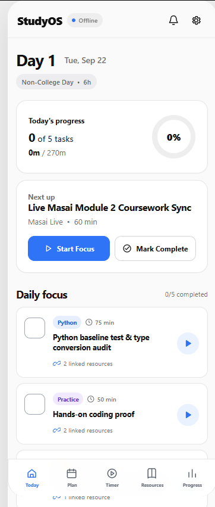
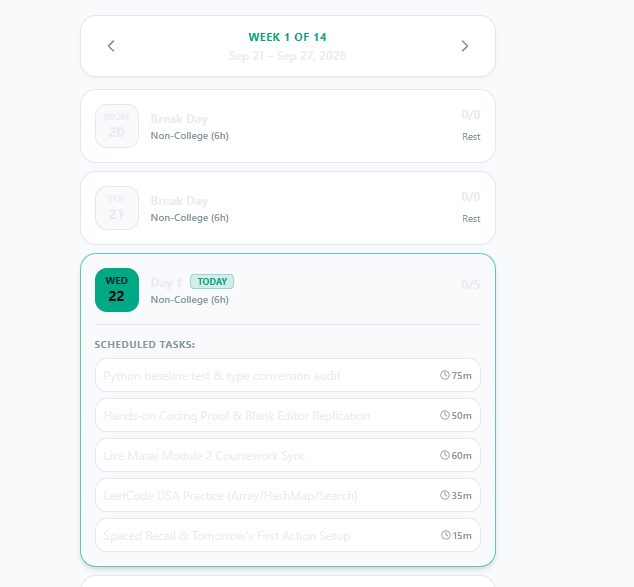
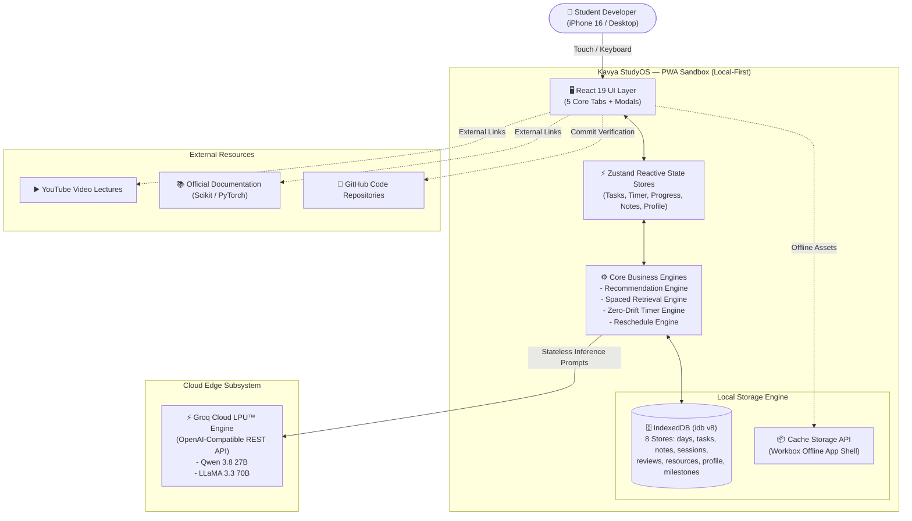
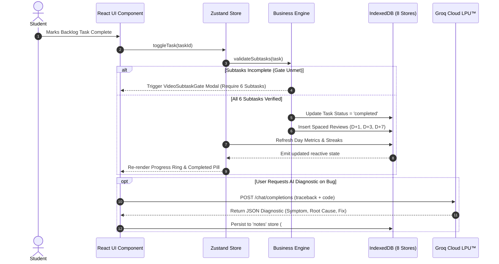
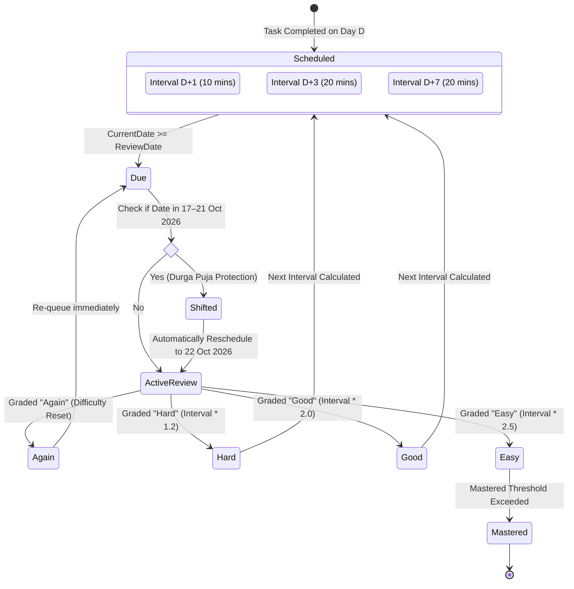
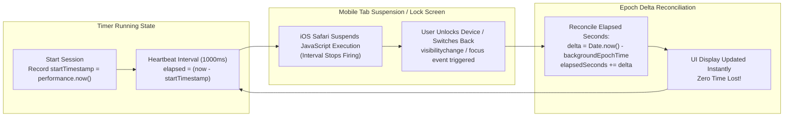

# 🧠 Kavya StudyOS

<div align="center">



### **Offline-First Machine Learning Sprint Operating System, Active Recall Engine & Recovery Dashboard**

[](https://react.dev/)
[](https://www.typescriptlang.org/)
[](https://vitejs.dev/)
[](https://tailwindcss.com/)
[](https://groq.com/)
[](https://web.dev/progressive-web-apps/)
[](LICENSE)

[Live Demo](#-getting-started) • [Architecture](#-system-architecture) • [Features](#-core-features) • [Data Flow](#-data-flow--storage-engine) • [Installation](#-getting-started)

</div>

---

## 🌟 Executive Summary

**Kavya StudyOS** is a sovereign, offline-first personal operating system engineered specifically for B.Tech Computer Science (AI/ML) students. It structures a disciplined **101-day intensive learning sprint** (targeting December 31, 2026), systematically eliminates educational backlogs through strict practice gates, guards mental health with cultural rest protections, and embeds an ultra-low latency AI study coach powered by the Groq Cloud LPU™ Inference Engine.

Built with **React 19, TypeScript, Tailwind CSS, and local-first IndexedDB**, StudyOS functions with **zero mandatory backend servers**, guaranteeing 100% functionality on mobile devices even in offline library basements or airplane mode.

---

## 📸 Interface Preview

<div align="center">
  <table>
    <tr>
      <td align="center"><b>Today's Command Center</b></td>
      <td align="center"><b>Weekly Sprint & Calendar Roadmap</b></td>
    </tr>
    <tr>
      <td></td>
      <td></td>
    </tr>
  </table>
</div>

---

## ✨ Core Features

### 1. 🎯 101-Day Machine Learning Sprint Curriculum
- **Target Completion Date:** 31 December 2026.
- **4 Milestone Phases:**
  - **Phase 1 (Days 1–25):** Python Mastery, DSA Foundations & Masai Backlog Elimination.
  - **Phase 2 (Days 26–50):** Applied Linear Algebra, Calculus, Probability & Exploratory Data Analysis (EDA).
  - **Phase 3 (Days 51–75):** Classical Machine Learning (Scikit-Learn, Regression, SVM, Ensemble Trees).
  - **Phase 4 (Days 76–101):** Deep Learning, PyTorch, Convolutional & Sequential Neural Architectures, Production Deployment.

### 2. 🛡️ Strict Video Subtask Completion Gate
- Eliminates passive lecture binge-watching.
- Tasks categorized as `masai_backlog` **cannot** be checked off without satisfying the **6 Active Learning Criteria**:
  1. 📖 **Active Viewing:** Pausing at demonstrations; no passive 2x background playback.
  2. 💻 **Blank-Editor Recreation:** Re-implementing code examples from an empty file.
  3. 🧠 **Recall Question Generation:** Formulating 3–5 conceptual testing prompts.
  4. 🧪 **Variation Solving:** Testing boundary values and edge cases.
  5. ⚠️ **Error Log Submission:** Documenting core doubt/misconception in the diagnostic tracker.
  6. 🔗 **GitHub Commit Proof:** Attaching an immutable repository commit link.

### 3. 🧠 Ebbinghaus Spaced Active Recall Engine
- Mathematical retention scheduler based on Hermann Ebbinghaus's forgetting curve.
- Completed topics automatically spawn review intervals at **D+1 (10 mins)**, **D+3 (20 mins)**, and **D+7 (20 mins)**.
- **Durga Puja Invariant:** Reviews mathematically landing during October 17–21, 2026 are automatically shifted forward to October 22 to preserve family rest without breaking streaks.
- Daily review cap enforced at a maximum of 2 cards per day to avoid overload.

### 4. ⏱️ Zero-Drift iOS Screen-Lock Resilient Timer
- Standard web `setInterval` timers drift or freeze completely when iOS Safari sleeps or switches background tabs.
- StudyOS uses an epoch timestamp reconciliation pattern (`performance.now()` + `Date.now()` delta) synced across `visibilitychange` and window `focus` events.
- Timer mode supports **25m Pomodoro**, **50m Deep Work**, and **90m Ultradian Rhythm** cycles with manual offline logging.

### 5. ⚡ Groq Cloud LPU™ AI Study Coach
- **Ultra-low latency inference** (sub-500ms token generation) powered by `qwen/qwen3.8-27b` and `llama-3.3-70b-versatile`.
- **Three Core AI Modes:**
  - **Error Diagnostic Lab:** Pinpoints symptoms, identifies root causes, provides working code fixes, and teaches interview defense points.
  - **Concept Intuition Analogy:** Explains complex ML math in intuitive everyday analogies (supports both English and Hinglish/CampusX style).
  - **Active Recall Generator:** Converts study notes and task topics into 5 high-signal active retrieval questions.
- **Anti-Guilt Guardrail:** The AI strictly never scolds missed days or recommends unhealthy 14-hour catch-up sessions.

### 6. 📱 Sovereign Offline-First PWA
- Complete data ownership stored in **8 IndexedDB object stores**.
- **One-Tap Full JSON Backup & Restore** with cryptographic schema validation.
- **Markdown Export:** Dumps all study notes, reflections, and error logs into clean `.md` files.
- Mobile viewport optimized with minimum **16px form inputs** to eliminate iOS Safari auto-zooming.

---

## 🏛️ System Architecture

### 1. High-Level Architecture (C4 Container Diagram)



---

### 2. Local-First IndexedDB Data Flow



---

### 3. Spaced Active Recall State Machine



---

### 4. Zero-Drift Timer Architecture



---

## 📂 Project Directory Structure

```text
kavya-study-os/
├── public/                     # Static assets, Web App Manifest, PWA icons
│   ├── icons/                  # 192x192 and 512x512 PWA app icons
│   └── manifest.webmanifest    # Standalone PWA manifest specification
├── docs/                       # Architectural documentation & assets
│   └── screenshots/            # Interface captures for README & docs
├── src/
│   ├── components/             # Modular React UI components
│   │   ├── ai/                 # Groq AI Recall, Analogy, & Diagnostic modals
│   │   ├── common/             # Checkbox, ProgressRing, Toast, Badges
│   │   ├── layout/             # AppHeader, BottomNav (5 tabs)
│   │   ├── notes/              # MarkdownEditor, ErrorLogCard, NotesSearch
│   │   ├── plan/               # DayPlan, WeekView, MonthCalendar, Reschedule
│   │   ├── progress/           # BacklogCounter, WeeklyChart, Heatmap, Scorecard
│   │   ├── resources/          # ResourceCard, Segments, BrokenLinkModal
│   │   ├── settings/           # College, LifeBlocks, AISettings, BackupRestore
│   │   ├── task/               # NextActionHero, TaskCard, DetailSheet, VideoGate
│   │   └── timer/              # TimerDisplay, TimerControls, ManualSession
│   ├── engines/                # Pure business logic algorithms
│   │   ├── dateUtils.ts        # ISO date math & day index conversion
│   │   ├── recommendationEngine.ts # Priority-weighted next action selector
│   │   ├── rescheduleEngine.ts # Safe rescheduling with velocity caps
│   │   ├── spacedRetrievalEngine.ts # SuperMemo/Ebbinghaus interval math
│   │   └── timerEngine.ts      # Zero-drift timer epoch reconciler
│   ├── seeds/                  # Immutable initial datasets
│   │   ├── canonicalResources.ts # 62 curated AI/ML learning resources
│   │   └── roadmapSeeds.ts     # 101-day curriculum seed (Sept 22 - Dec 31)
│   ├── services/               # Infrastructure & external connectors
│   │   ├── ai/                 # Groq SDK / REST client with prompt templates
│   │   ├── db/                 # IndexedDB database initializers & stores
│   │   └── export/             # JSON backup export/import & Markdown exporter
│   ├── stores/                 # Zustand reactive state stores
│   │   ├── useNoteStore.ts     # Markdown notes & error log state
│   │   ├── useProfileStore.ts  # College schedule, daily anchors & API keys
│   │   ├── useProgressStore.ts # Daily minutes, completions & streak analytics
│   │   ├── useResourceStore.ts # Bookmarks, broken links & custom links
│   │   ├── useRevisionStore.ts # Active recall queue & graded reviews
│   │   ├── useTaskStore.ts     # Daily tasks, subtasks & undo histories
│   │   └── useTimerStore.ts    # Running timer state & zero-drift heartbeat
│   ├── styles/                 # Global styles & Tailwind utilities
│   │   └── globals.css         # High-contrast light theme & safe areas
│   ├── types/                  # Strict TypeScript domain interfaces
│   │   └── index.ts            # StudyTask, DayPlan, Note, Resource, Profile
│   ├── App.tsx                 # Root application shell & modal controller
│   └── main.tsx                # React DOM entry point & Service Worker registration
├── ARCHITECTURE.md             # In-depth 900-line engineering specification
├── PROBLEM_STATEMENT.md        # Comprehensive product requirements (PRD)
├── tailwind.config.js          # Design tokens & color palettes
├── tsconfig.json               # Strict TypeScript compiler options
└── vite.config.ts              # Vite PWA plugin & build configuration
```

---

## 🛠️ Technology Stack

| Layer | Technology | Purpose |
| :--- | :--- | :--- |
| **Framework** | [React 19](https://react.dev/) | Modern concurrent UI rendering with hooks |
| **Language** | [TypeScript 5.7](https://www.typescriptlang.org/) | 100% strict type safety & zero `any` policy |
| **Bundler & Tooling** | [Vite 6.0](https://vitejs.dev/) | Sub-second HMR & optimized production chunking |
| **Styling** | [Tailwind CSS 3.4](https://tailwindcss.com/) | High-contrast StudyOS light design system |
| **Icons** | [Lucide React](https://lucide.dev/) | Lightweight, consistent iconography |
| **State Management** | [Zustand 5.0](https://zustand-demo.pmnd.rs/) | Minimalist reactive state stores with zero boilerplate |
| **Local Database** | [idb 8.0](https://github.com/jakearchibald/idb) | Promise-based typed IndexedDB client (8 stores) |
| **PWA & Offline** | [vite-plugin-pwa](https://vite-pwa-org.netlify.app/) | Service Worker caching via Workbox |
| **AI Inference** | [Groq Cloud LPU™](https://console.groq.com/) | Ultra-low latency LLaMA 3.3 70B & Qwen 3.8 inference |
| **Celebration FX** | [canvas-confetti](https://www.npmjs.com/package/canvas-confetti) | Dopamine rewards for milestone & task completion |

---

## 🚀 Getting Started

### Prerequisites
- [Node.js](https://nodejs.org/) (version 18.0 or later recommended)
- [npm](https://www.npmjs.com/) or [pnpm](https://pnpm.io/)
- A free [Groq Cloud API Key](https://console.groq.com/) (optional; default demonstration key pre-wired)

### 1. Clone the Repository
```bash
git clone https://github.com/kavya0704/kavya-study-os.git
cd kavya-study-os
```

### 2. Install Dependencies
```bash
npm install
```

### 3. Configure Environment (Optional)
Copy the example environment file:
```bash
cp .env.example .env
```
Add your custom Groq API Key if desired:
```env
VITE_GROQ_API_KEY=gsk_your_groq_api_key_here
```
*(Note: You can also configure or test your Groq API Key dynamically inside the in-app **Settings** tab at any time without rebuilding.)*

### 4. Launch Development Server
```bash
npm run dev
```
Open your browser and navigate to `http://localhost:5173/`.

### 5. Build for Production
```bash
npm run build
```
Generates a production bundle in `dist/` with PWA service worker manifests ready for deployment.

---

## 📱 Mobile Installation Guide (PWA)

### Apple iOS (Safari on iPhone 16)
1. Open Safari and navigate to your deployed StudyOS URL.
2. Tap the **Share** button (the square icon with an upward arrow) in the bottom navigation bar.
3. Scroll down and select **"Add to Home Screen"**.
4. Confirm by tapping **"Add"** in the top right.
5. Launch **StudyOS** directly from your Home Screen in full-screen standalone mode with native safe-area insets.

### Google Android (Chrome)
1. Open Chrome and navigate to the deployed URL.
2. Tap the **three vertical dots** in the top right.
3. Select **"Install app"** or **"Add to Home Screen"**.
4. Enjoy offline instant launch with home screen integration.

---

## 🛡️ Invariants & Guardrails

| Invariant | Mechanism | Rationale |
| :--- | :--- | :--- |
| **Durga Puja Invariant** | Automatic date shift to 22 Oct | Protects cultural rest (17–21 Oct 2026); zero tasks allowed; preserves streaks. |
| **Masai Gate Invariant** | 6 mandatory active subtasks | Strictly prohibits passive video watching from being marked as completed. |
| **Anti-Guilt Pacing** | Velocity capped at 3.5h / 6.0h | Prevents counter-productive burnout cycles and impossible catch-up schedules. |
| **Anti-Zoom Rule** | `font-size: 16px` on all inputs | Prevents iOS WebKit viewport zoom jumps on mobile focus. |
| **Data Sovereignty** | 100% Local IndexedDB | Student data is never locked into proprietary cloud silos. Exportable anytime. |

---

## 📄 License

Distributed under the **MIT License**. See [`LICENSE`](LICENSE) for more information.

---

<div align="center">

**Crafted with ❤️ for Kavya Shaw's Machine Learning Journey.**  
*Continuous progress over sporadic intensity. One focused day at a time.*

</div>
